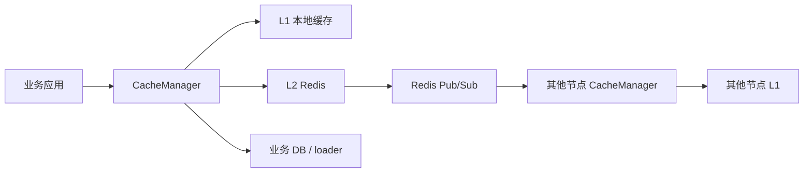
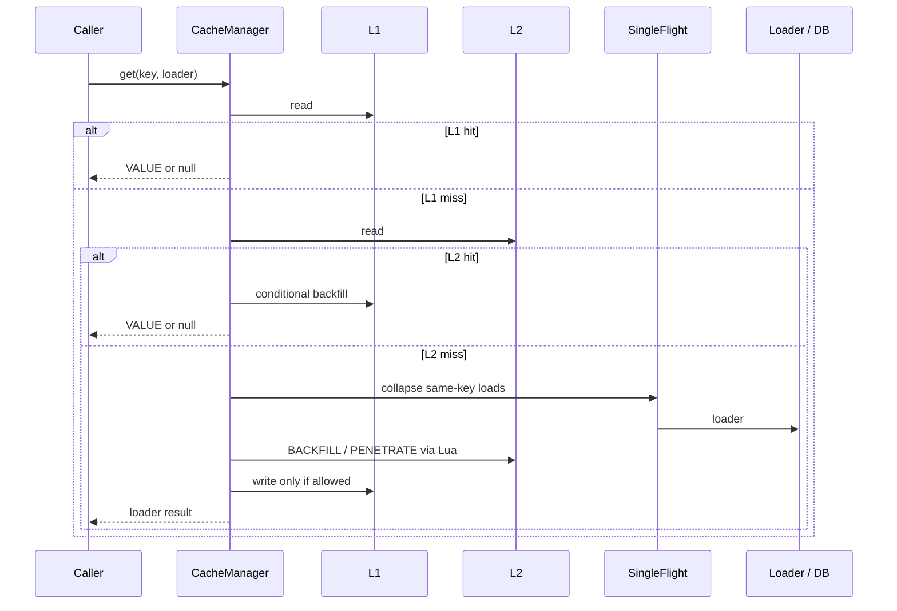
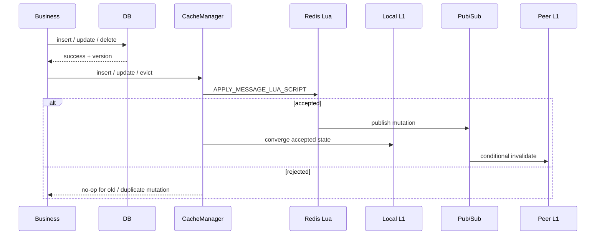
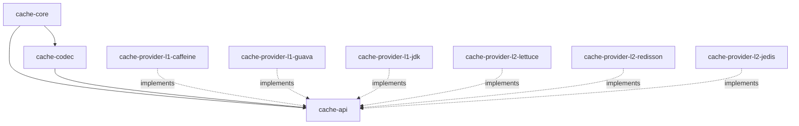

<div align="center">
  <h1>多级缓存框架 (Multi-Tier Cache Framework)</h1>


[](https://central.sonatype.com/search?q=io.github.dk900912)

  <p>面向 Java 21 的 L1 + L2 多级缓存框架，用业务版本号和 Redis Lua 裁决解决热点读、击穿、穿透、乱序写、删除墓碑和最终一致性问题。</p>
</div>

## README 定位

这份 README 有两条阅读路径：

| 读者 | 目标 | 建议阅读 |
| :--- | :--- | :--- |
| 接入方 | 快速知道怎么引入、怎么配置、怎么读写缓存、哪些契约不能破坏 | 先读“快速上手”和“接入契约” |
| 维护者 / 设计评审 | 回忆每个功能为什么这么设计，以及异常场景如何应对 | 重点读“设计备忘录”和“故障应对” |

一句话理解：

> `L2` 是权威版本裁决点，`L1` 是可丢弃的本地副本，Pub/Sub 只是 L1 失效加速器；真正的一致性依赖业务 `version` 和 Redis Lua 原子裁决。

## 目录

- [能力边界](#能力边界)
- [快速上手](#快速上手)
- [接入契约](#接入契约)
- [设计备忘录](#设计备忘录)
- [故障应对](#故障应对)
- [配置速查](#配置速查)
- [可观测性](#可观测性)
- [模块结构](#模块结构)
- [开发与验证](#开发与验证)
- [FAQ](#faq)

## 能力边界

| 能力 | 支持情况 | 说明 |
| :--- | :---: | :--- |
| L1 + L2 多级缓存 | 支持 | L1 吸收进程内热点，L2 作为跨节点共享状态和版本裁决点 |
| 缓存击穿保护 | 支持 | 本机 `SingleFlight` 默认开启；可选 L2 分布式加载锁做全局合并回源 |
| 缓存穿透防护 | 支持 | `PENETRATE(version=-1)` 作为低优先级短 TTL 空值哨兵 |
| 乱序 / 重复写防御 | 支持 | L2 Lua 和 L1 收敛都使用版本与状态优先级判断 |
| 删除墓碑 | 支持 | `evict` 写入 `DELETE` tombstone，不是简单删除 key |
| Redis Cluster / ACL | 支持 | 内置 Jedis、Lettuce、Redisson Provider |
| 运行时指标 | 支持 | 通过 `CacheMonitor` 暴露 L1、L2、回源、Pub/Sub、分布式锁等计数 |
| 跨节点强一致读 | 不支持 | 当前语义是 AP 倾向的最终一致，不承诺线性一致 |
| 可靠广播 | 不支持 | Redis Pub/Sub 不保证 peer 节点一定收到消息 |
| 同 key 删除后低版本复活 | 不支持 | 删除后重新新增必须使用新的 DB 主键和新的 cache key |

## 快速上手

当前版本：`1.0.0-M6`

### 1. 引入依赖

推荐用 BOM 管理版本，然后显式选择 `core + codec + 一个 L1 provider + 一个 L2 provider`。

```xml
<dependencyManagement>
  <dependencies>
    <dependency>
      <groupId>io.github.dk900912</groupId>
      <artifactId>multi-tier-cache-framework</artifactId>
      <version>1.0.0-M6</version>
      <type>pom</type>
      <scope>import</scope>
    </dependency>
  </dependencies>
</dependencyManagement>

<dependencies>
  <dependency>
    <groupId>io.github.dk900912</groupId>
    <artifactId>cache-core</artifactId>
  </dependency>
  <dependency>
    <groupId>io.github.dk900912</groupId>
    <artifactId>cache-codec</artifactId>
  </dependency>
  <dependency>
    <groupId>io.github.dk900912</groupId>
    <artifactId>cache-provider-l1-caffeine</artifactId>
  </dependency>
  <dependency>
    <groupId>io.github.dk900912</groupId>
    <artifactId>cache-provider-l2-lettuce</artifactId>
  </dependency>
</dependencies>
```

Provider 选择建议：

| 层级 | 生产推荐 | 说明 |
| :--- | :--- | :--- |
| L1 | `cache-provider-l1-caffeine` | 性能和能力优先，支持更完整的本地缓存能力 |
| L2 | `cache-provider-l2-lettuce` | 默认推荐；也可按团队技术栈选择 Jedis 或 Redisson |

`AUTO` 选择顺序：L1 为 `CAFFEINE -> GUAVA -> JDK`，L2 为 `LETTUCE -> REDISSON -> JEDIS`。生产环境建议显式指定 provider，避免 classpath 变化导致行为变化。

### 2. 创建配置

```java
import io.github.dk900912.multitiercache.api.model.CacheConfig;
import io.github.dk900912.multitiercache.api.model.CacheConfig.L1ProviderType;
import io.github.dk900912.multitiercache.api.model.CacheConfig.L2ProviderType;

import java.time.Duration;
import java.util.List;

CacheConfig config = new CacheConfig();

config.getL1().setEnabled(true);
config.getL1().setProvider(L1ProviderType.CAFFEINE);
config.getL1().setRecordStats(true);
config.getL1().setMaximumSize(10_000L);
config.getL1().setExpireAfterWrite(Duration.ofSeconds(30));
config.getL1().setExpireAfterAccess(Duration.ofSeconds(30));

config.getL2().setEnabled(true);
config.getL2().setProvider(L2ProviderType.LETTUCE);
config.getL2().setHosts(List.of(
        "127.0.0.1:7001",
        "127.0.0.1:7002",
        "127.0.0.1:7003"
));
config.getL2().setMutationChannelName("cache:mutation:user");
config.getL2().setUsername("cache_user");
config.getL2().setPassword("change-me");
config.getL2().setConnectionTimeout(Duration.ofSeconds(2));
config.getL2().setSocketTimeout(Duration.ofSeconds(2));

config.getCodec().setTrustedPackages(List.of("com.yourcompany.domain"));

config.getLoadPolicy().setDefaultTtl(Duration.ofMinutes(10));
config.getLoadPolicy().setBackfillTtl(Duration.ofMinutes(10));
config.getLoadPolicy().setPenetrationTtl(Duration.ofSeconds(30));
config.getOriginLoadLimiter().setLocalLoadWaitTimeout(Duration.ofSeconds(3));
```

### 3. 启动与关闭

```java
import io.github.dk900912.multitiercache.api.CacheManager;
import io.github.dk900912.multitiercache.core.CacheManagerFactory;

CacheManager cacheManager = CacheManagerFactory.create(config);
cacheManager.bootstrap();

try {
    // read / insert / update / evict
} finally {
    cacheManager.shutdown();
}
```

`shutdown()` 建议显式调用，用于关闭 Pub/Sub 订阅、Redis 连接、Provider 资源和内部执行器。

### 4. 读缓存

优先使用 `CacheLoader`，因为它能明确返回 DB 版本号和 TTL。

```java
import io.github.dk900912.multitiercache.api.CacheKey;
import io.github.dk900912.multitiercache.api.model.CacheLoadResult;

import java.time.Duration;

CacheKey key = CacheKey.of("user", 1001L);

User user = cacheManager.get(key, () -> {
    User dbUser = userRepository.findById(1001L);
    if (dbUser == null) {
        return CacheLoadResult.penetration(Duration.ofSeconds(30));
    }
    return CacheLoadResult.of(dbUser, dbUser.version(), Duration.ofMinutes(30));
});
```

读路径顺序：

```text
L1 -> L2 -> SingleFlight -> loader -> L2 read-backfill -> conditional L1 backfill
```

当 L2 启用时，loader 结果只有在 L2 接受后才会写入 L1。若 L2 read-backfill 失败，业务读仍返回 loader 结果，但不会把该结果写入 L1。

### 5. 写缓存

框架是 cache-aside 语义：业务必须先成功写 DB，再调用缓存 mutation。

```java
User inserted = userRepository.insert(new UserCreateCommand("Alice"));
cacheManager.insert(
        CacheKey.of("user", inserted.id()),
        inserted,
        inserted.version(),
        Duration.ofMinutes(30)
);

User updated = userRepository.updateName(1001L, "Bob");
cacheManager.update(
        CacheKey.of("user", updated.id()),
        updated,
        updated.version(),
        Duration.ofMinutes(30)
);

long deleteVersion = userRepository.deleteByIdWithVersion(1001L);
cacheManager.evict(
        CacheKey.of("user", 1001L),
        deleteVersion,
        Duration.ofMinutes(5)
);
```

写路径顺序：

```text
DB success -> CacheMessage(type, version, ttl) -> L2 Lua CAS -> publish -> local L1 converge
```

重要区别：

- `insert` 表示 DB 新增成功后的缓存写入。
- `update` 表示 DB 已有记录更新成功后的缓存写入。
- `evict` 表示 DB 删除成功后的删除墓碑写入。
- 不要把业务 upsert 混成框架语义；调用方应明确选择 insert、update 或 evict。

### 6. 打开全局击穿保护

默认只在当前 JVM 内合并同 key 并发 miss。多实例应用如果希望减少跨节点重复回源，可以开启 `GLOBAL`。

```java
config.getOriginLoadLimiter().setOriginLoadLimitMode(
        CacheConfig.OriginLoadLimitMode.GLOBAL);
config.getOriginLoadLimiter().setGlobalLoadWaitTimeout(Duration.ofSeconds(3));
config.getOriginLoadLimiter().setGlobalLoadFailurePolicy(
        CacheConfig.GlobalLoadFailurePolicy.FAIL_OPEN);
```

约束：

- 必须启用 L2。
- `globalLoadWaitTimeout` 必须小于 `localLoadWaitTimeout`。
- `FAIL_OPEN` 在锁故障时允许本机回源，优先可用性。
- `FAIL_CLOSED` 在锁故障时直接失败，优先保护 DB。

## 接入契约

这部分是接入方必须遵守的约束。违反这些约束时，框架不能保证最终一致性。

| 契约 | 是否必须 | 说明 |
| :--- | :---: | :--- |
| DB 是 Root of Trust | 是 | 缓存 mutation 必须发生在 DB insert/update/delete 成功之后 |
| 同一 DB 记录生命周期内 `version` 严格单调递增 | 是 | 推荐使用乐观锁字段或高精度 `updated_time` |
| 删除也要有版本号 | 是 | `evict` 写 tombstone，需要阻止旧值回填 |
| 删除后重新新增使用新主键和新 cache key | 是 | 同 key 不支持以重置版本复活 |
| 业务对象可被安全反序列化 | 是 | 必须配置 `trustedPackages` |
| 接受最终一致性 | 是 | 不承诺跨节点写后立即可见 |
| 接受 Pub/Sub 非可靠投递 | 是 | Pub/Sub 只加速 L1 失效，不是可靠消息系统 |

版本来源建议：

| 来源 | 适用情况 | 注意点 |
| :--- | :--- | :--- |
| DB 乐观锁自增字段 | 最推荐 | `version = version + 1`，语义清晰 |
| 高精度更新时间 | 可用 | 需要保证同一记录生命周期内严格递增 |
| 业务事件版本 | 可用 | 事件生产方必须保证单 key 单调 |

## 设计备忘录

### 架构分工



| 组件 | 职责 | 不承担什么 |
| :--- | :--- | :--- |
| L1 | 本地热点加速、条件回填、本节点收敛 | 不做跨节点真相源 |
| L2 | 共享缓存、版本裁决、删除墓碑保存 | 不替代 DB 的 Root of Trust |
| Pub/Sub | 远端 L1 失效加速 | 不保证可靠投递，不做数据预热依据 |
| DB | 业务事实源 | 框架不生成业务版本 |

### 状态模型

单个 cache key 在缓存层只有三类有效状态。

| 状态 | 是否有数据 | 是否参与业务版本排序 | 语义 |
| :--- | :---: | :---: | :--- |
| `VALUE(version)` | 是 | 是 | 真实业务值，由 `INSERT`、`UPDATE`、`BACKFILL` 产生 |
| `DELETE_TOMBSTONE(version)` | 否 | 是 | 删除墓碑，由 `evict` 产生 |
| `PENETRATE(version=-1)` | 否 | 否 | 穿透哨兵，仅表示短 TTL 空值 hint |

### 为什么 L2 先于 L1

启用 L2 时，写路径必须先让 L2 Lua 接受，再更新当前节点 L1。

如果先改 L1，当前节点的并发读可能在 L1 miss 后读到旧 L2，再把旧值灌回 L1。L2 先成为权威后，当前节点 L1 只会保存已经被 L2 接受的 winner 或 tombstone。

### 为什么远端消息只失效 L1

远端节点收到 Pub/Sub mutation 后，只对已有且落后的 L1 条目做条件失效，不把 payload 写入空 L1。

原因：

- Redis Pub/Sub 不是可靠消息系统，payload 不能被当作可靠预热数据。
- 消息可能乱序或重复，直接预热会放大旧消息影响。
- 空 L1 下次读可以从权威 L2 收敛，代价只是一次 L2 read。

这也是“消费 L2 消息后删除 L1 key”方案的推荐形态：可以删除 L1，但应保留版本和状态判断，避免旧消息无条件清掉更新的本地副本。

### 为什么删除写 tombstone

`evict` 不做简单 `DEL key`，而是写入 `DELETE_TOMBSTONE(version)`。

原因：

- 阻止旧版本 `BACKFILL` 把已删除数据重新写回。
- 阻止乱序的旧 `INSERT / UPDATE` 覆盖删除状态。
- Pub/Sub 丢消息时，远端节点后续读 L2 仍能看到删除裁决。
- L1 only 模式下，本地 tombstone 也能阻止旧 loader 结果回填。

### 版本裁决规则

| Incoming | Current | 是否接受 | 设计意图 |
| :--- | :--- | :--- | :--- |
| `PENETRATE` | absent / `PENETRATE` | 接受 | 只做空值短 TTL hint |
| `PENETRATE` | `VALUE` / `DELETE` | 拒绝 | 空值 hint 不能覆盖真实状态 |
| `VALUE(newV)` | absent / `PENETRATE` | 接受 | 真实值优先级高于空值 hint |
| `VALUE(newV)` | `VALUE(oldV)` | `newV > oldV` | 拒绝旧写和重复写 |
| `VALUE(newV)` | `DELETE(oldV)` | 拒绝 | 同 key 删除后不能复活 |
| `DELETE(newV)` | absent | 接受 | 即使 L2 没有旧值，也要记录删除墓碑 |
| `DELETE(newV)` | `VALUE(oldV)` | `newV >= oldV` | 允许同版本删除覆盖 live value |
| `DELETE(newV)` | `DELETE(oldV)` | `newV >= oldV` | 允许刷新墓碑 TTL |

### 读路径设计



关键点：

- `SingleFlight` 只合并同 key 并发回源，不改变一致性裁决。
- `Supplier` 读法返回 `null`，或 `CacheLoader` 返回 `CacheLoadResult.penetration(...)`，都会写入短 TTL `PENETRATE`。
- L2 读故障时降级到 loader；但 L2 启用且 read-backfill 失败时，不把 loader 结果写入 L1。

### 写路径设计



关键点：

- 业务 mutation 发布 Pub/Sub，read-backfill 不发布。
- L2 mutation 写失败会向调用方抛出，避免调用方误以为缓存已收敛。
- 本节点 mutation 被 L2 接受后会物化到 L1，包括 DELETE tombstone。
- 远端节点只失效已有 L1，不预热空 L1。

## 故障应对

| 场景 | 框架行为 | 设计取舍 |
| :--- | :--- | :--- |
| L2 读失败 | 记录 `l2ReadPathFailureCount`，降级 loader | 读可用性优先 |
| L2 read-backfill 失败 | 返回 loader 结果，但不写 L1 | 避免未被 L2 裁决的值污染 L1 |
| L2 mutation 写失败 | 抛出异常，并尝试失效本地 L1 | 写路径不静默降级 |
| Pub/Sub 消息乱序 / 重复 | L1 用版本与状态判断是否失效 | 旧消息不应扰动新状态 |
| Pub/Sub 处理队列过载 | L1 进入 `UNTRUSTED`，读写绕过 L1，恢复前清空一次 L1 | 宁可多读 L2，也不读可能陈旧的 L1 |
| Pub/Sub 订阅中断 | L1 进入 `UNTRUSTED`，订阅恢复后清空 L1 再恢复 | 处理通知缺口 |
| 分布式加载锁超时 | `FAIL_OPEN` 回源，`FAIL_CLOSED` 失败 | 由业务选择可用性或 DB 保护 |

生产注意：

- Pub/Sub 不能保证消息一定送达，最终收敛依赖后续 L2 读取、L1 TTL 和业务版本裁决。
- 如果业务强依赖可靠失效传播，应将底层广播升级为 Redis Stream 或 MQ，而不是把 Pub/Sub 当可靠消息。
- L1 的 `expireAfterWrite` 是远端消息完全丢失时的陈旧窗口上界之一，应按业务容忍度配置。

## 配置速查

### 常用配置

| 配置 | 默认值 | 建议 |
| :--- | :--- | :--- |
| `l1.enabled` | `true` | 多实例热点读建议开启 |
| `l1.provider` | `AUTO` | 生产显式设为 `CAFFEINE` |
| `l1.maximumSize` | `1000` | 按热点 key 数和内存预算调整 |
| `l1.expireAfterWrite` | `15s` | L1 + L2 同开时必须配置 |
| `l2.enabled` | `true` | 多节点最终一致建议开启 |
| `l2.provider` | `AUTO` | 生产显式设为 `LETTUCE`、`REDISSON` 或 `JEDIS` |
| `l2.hosts` | 无 | L2 启用时必须提供 |
| `l2.mutationChannelName` | `multi-tier-cache-mutation` | 按业务域隔离 |
| `codec.trustedPackages` | `[]` | 生产必须加入业务对象包名前缀 |
| `loadPolicy.defaultTtl` | `15s` | `Supplier` loader 默认 TTL |
| `loadPolicy.backfillTtl` | `15s` | DB 命中回填 TTL |
| `loadPolicy.penetrationTtl` | `30s` | 空值哨兵 TTL，避免过长 |
| `originLoadLimiter.originLoadLimitMode` | `LOCAL_ONLY` | 多实例热点 miss 可设为 `GLOBAL` |

### 模式选择

| 模式 | 配置 | 适用场景 | 风险 |
| :--- | :--- | :--- | :--- |
| L1 only | `l2.enabled=false` | 单体或本地热点加速 | 多节点不共享裁决 |
| L2 only | `l1.enabled=false` | 更简单的跨节点收敛 | 每次读都走网络 |
| L1 + L2 | 默认 | 多实例热点读和最终一致 | 需要接受短暂陈旧窗口 |

## 可观测性

```java
CacheRuntimeStats stats = cacheManager.getMonitor().getRuntimeStats();

long l1Hits = stats.getL1HitCount();
long l2Misses = stats.getL2MissCount();
long loads = stats.getOriginLoadCount();
long rejected = stats.getL2MutationRejectedCount();
```

重点指标：

| 指标 | 用途 |
| :--- | :--- |
| `l1HitCount / l1MissCount` | 判断本地热点吸收效果 |
| `l2HitCount / l2MissCount` | 判断共享缓存兜底效果 |
| `originLoadCount` | 判断真实 DB 回源压力 |
| `penetrationLoadCount` | 判断空查和穿透压力 |
| `l2ReadPathFailureCount` | 判断 Redis 读链路是否降级 |
| `l2MutationRejectedCount` | 观察旧版本、重复写、乱序写被拒绝的情况 |
| `l2MutationFailureCount` | 观察写路径 Redis 故障 |
| `pubSubDroppedMessageCount / pubSubInterruptionCount` | 观察 L1 失效传播缺口 |
| `l1UntrustedBypassCount` | 观察 L1 降级期间绕过量 |
| `distributedLockTimeoutCount / distributedLockFailureCount` | 观察全局击穿保护的锁等待和故障 |

指标解释注意：

- `l2MutationRejectedCount` 上升不一定是坏事，可能说明框架正在正确拒绝旧版本或重复写。
- 当前指标是进程内累计计数，不是完整的 Prometheus / Grafana 接入方案。
- 指标用于观察最终一致性与降级风险，不代表 L1 和 L2 强一致。

## 模块结构

| 模块 | 职责 |
| :--- | :--- |
| `cache-api` | 对外 API、配置模型、消息模型、SPI |
| `cache-core` | `DefaultCacheManager`、读写路径、`SingleFlight`、Lua 调度、版本比较 |
| `cache-codec` | 默认 Jackson 编解码和反序列化白名单 |
| `cache-provider-l1-caffeine` | Caffeine L1 Provider，生产推荐 |
| `cache-provider-l1-guava` | Guava L1 Provider |
| `cache-provider-l1-jdk` | JDK Map L1 Provider |
| `cache-provider-l2-jedis` | Jedis L2 Provider |
| `cache-provider-l2-lettuce` | Lettuce L2 Provider |
| `cache-provider-l2-redisson` | Redisson L2 Provider |

依赖关系：



## 开发与验证

常用命令：

```powershell
mvn test -DskipITs
```

只跑 core：

```powershell
mvn -pl cache-core -am test "-Dsurefire.failIfNoSpecifiedTests=false"
```

跑指定测试：

```powershell
mvn -pl cache-core -am test "-Dtest=DefaultCacheManagerWriteOrderingTest,DefaultCacheManagerObservabilityTest" "-Dsurefire.failIfNoSpecifiedTests=false"
```

集成测试依赖本地 Redis Cluster：

- 需要 `127.0.0.1:7001`、`127.0.0.1:7002`、`127.0.0.1:7003` 可达。
- 当前测试配置使用 ACL 用户 `dk900912`，密码 `qwe@1234`。
- 启动：`bash start-redis-cluster.sh`
- 停止：`bash stop-redis-cluster.sh`

如果本机 Maven 需要固定本地仓库：

```powershell
mvn test -DskipITs "-Dmaven.repo.local=C:\Users\dk900\.m2\repository"
```

发布到 Maven Central：

```powershell
mvn clean deploy
```

发布前确认：

- `~/.m2/settings.xml` 中已配置 server id `ossrh` 的 Central Portal token。
- 本机 GPG 可用，且签名密钥已配置完成。
- 当前 `pom.xml` 使用 `central-publishing-maven-plugin`，`autoPublish=true`，`deploy` 成功后会自动发布。

## FAQ

### 是否可以收到 L2 消息后直接删除 L1 key？

方向是对的，但不建议无条件删除。

当前推荐语义是：远端 Pub/Sub 消息只做 L1 失效，不预热空 L1；失效前保留版本和状态判断，避免迟到的旧消息清掉更新的本地副本。

### 为什么不直接删除 L2 key？

因为简单 `DEL` 会丢失版本裁决和删除墓碑。旧 loader、旧 backfill、乱序 `UPDATE` 可能把已删除或已更新的数据重新写回来。

### 为什么 `DELETE` 可以用 `>=`，而真实值更新用 `>`？

删除需要允许同版本 tombstone 覆盖 live value，确保 DB 删除成功后能稳定落到删除状态。真实值更新必须使用严格更大的版本，避免重复写和旧写覆盖新值。

### 为什么 `PENETRATE` 固定为 `version=-1`？

穿透哨兵不是业务生命周期状态，只是短 TTL 空值 hint。它必须低于真实值和删除墓碑，不能参与业务版本竞争。

### 是否 production-ready？

更准确地说：当前具备生产候选能力，但不是开箱即上的完整生产方案。

正式上线前建议补齐：

- 接入 Micrometer / Prometheus / Grafana 等指标平台。
- 做 Redis 故障、网络抖动、Pub/Sub 中断、应用 STW 的演练。
- 按业务容忍度定标 L1 TTL、backfill TTL、penetration TTL、delete tombstone TTL。
- 如果需要可靠广播，将 Pub/Sub 升级为可靠消息链路。
