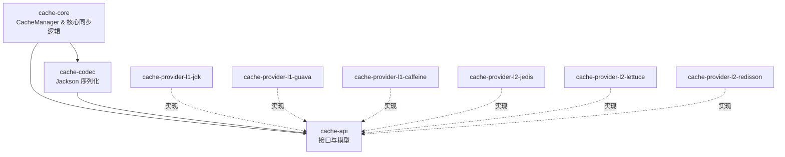
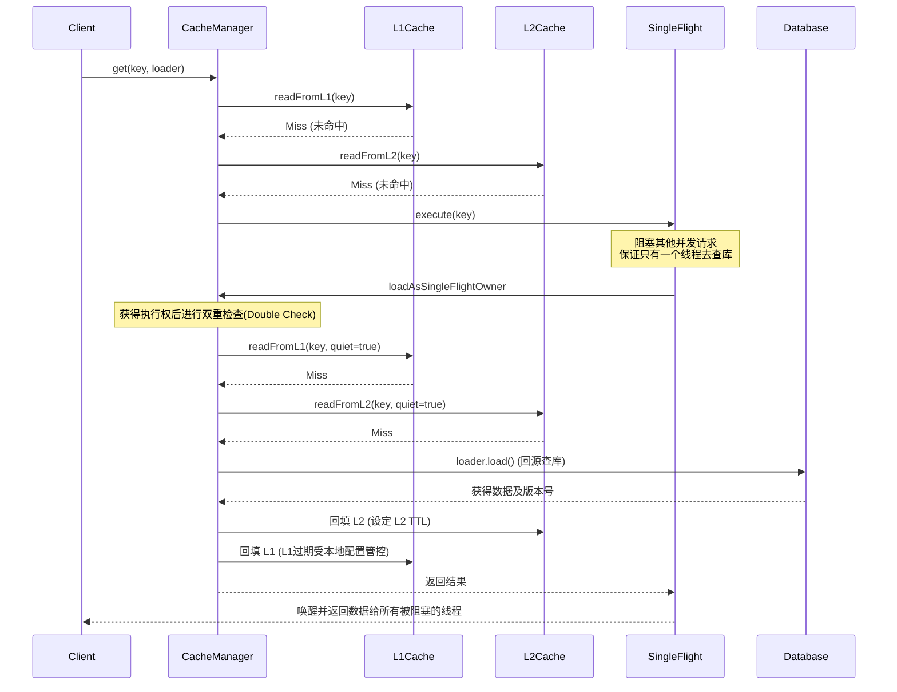
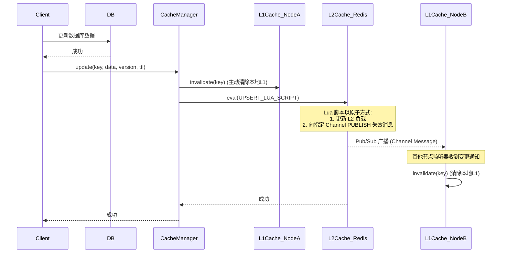

# 多级缓存框架


一个专为 Java 应用程序设计的高性能、健壮且高度可扩展的多级缓存框架。

## 1. 接入指南

本框架提供了一套完整的多级缓存解决方案（L1 本地缓存 + L2 分布式缓存），旨在解决常见的缓存痛点，例如缓存穿透、缓存击穿（通过内置的 `SingleFlight` 机制防范），以及分布式节点间的缓存一致性（通过 Redis Pub/Sub 广播 L1 失效）。

**新特性声明：全面支持 Redis 7.0 的 ACL（用户名+密码）安全认证机制！**

### Maven 依赖

项目采用多模块发布方式。通常你需要引入 `cache-core` 核心模块，并根据需求挑选一个 L1 Provider 与一个 L2 Provider；下面示例直接显式声明统一版本号。

```xml
<dependencies>
    <!-- 核心框架 -->
    <dependency>
        <groupId>io.github.dk900912</groupId>
        <artifactId>cache-core</artifactId>
        <version>1.0.0-SNAPSHOT</version>
    </dependency>

    <!-- 选择一个 L1 Provider（例如 Caffeine） -->
    <dependency>
        <groupId>io.github.dk900912</groupId>
        <artifactId>cache-provider-l1-caffeine</artifactId>
        <version>1.0.0-SNAPSHOT</version>
    </dependency>

    <!-- 选择一个 L2 Provider（例如 Lettuce） -->
    <dependency>
        <groupId>io.github.dk900912</groupId>
        <artifactId>cache-provider-l2-lettuce</artifactId>
        <version>1.0.0-SNAPSHOT</version>
    </dependency>
</dependencies>
```

### 极简初始化与使用示例

```java
import io.github.dk900912.multitiercache.api.CacheManager;
import io.github.dk900912.multitiercache.api.model.CacheConfig;
import io.github.dk900912.multitiercache.core.CacheManagerFactory;
import java.time.Duration;
import java.util.List;

public class CacheExample {
    public static void main(String[] args) {
        CacheConfig config = new CacheConfig();
        
        // 配置 L1 本地缓存
        config.getL1().setEnabled(true);
        config.getL1().setMaximumSize(10_000L);
        config.getL1().setExpireAfterWrite(Duration.ofMinutes(10));
        
        // 配置 L2 分布式缓存
        config.getL2().setEnabled(true);
        config.getL2().setHosts(List.of("127.0.0.1:7001", "127.0.0.1:7002", "127.0.0.1:7003"));
        config.getL2().setMutationChannelName("cache:mutation");
        
        // 创建并启动 CacheManager
        CacheManager cacheManager = CacheManagerFactory.create(config);
        cacheManager.bootstrap();
        
        // --- 核心业务使用示例（模拟 userRepository 的真实调用） ---
        String userId = "user:1001";
        
        // 1. Insert: 数据库插入后，获取到刚生成的实体及版本号，写入缓存
        User newUser = userRepository.insert(new User("Alice"));
        cacheManager.insert(() -> userId, newUser, newUser.getVersion(), Duration.ofMinutes(30));
        
        // 2. Get: 查询缓存 (将直接命中刚才的 insert)
        User user = cacheManager.get(
            () -> userId, 
            () -> userRepository.findById(1001L), 
            Duration.ofMinutes(30)
        );
        System.out.println("Cached Value: " + user.getName());
        
        // 3. Update: 模拟 DB 乐观锁更新成功后，获取最新版本号更新缓存
        User updatedUser = userRepository.updateNameWithOptimisticLock(1001L, "Bob");
        if (updatedUser != null) {
            cacheManager.update(() -> userId, updatedUser, updatedUser.getVersion(), Duration.ofMinutes(30));
        }
        
        // 4. Evict: 模拟 DB 删除，先查出当前版本号（或在删除时返回），然后驱逐缓存
        Long currentVersion = userRepository.findById(1001L).getVersion();
        userRepository.deleteById(1001L);
        cacheManager.evict(() -> userId, currentVersion + 1, Duration.ofMinutes(5));
        
        // 安全关闭，释放底层线程和资源
        cacheManager.shutdown();
    }
}
```

### Redis Cluster 部署

> Redis 7 里 key 权限和 channel 权限是分开的，需要全部赋予权限！

## 2. 模块间依赖拓扑架构



## 3. 拓展点与灵活定制

本框架利用 Java SPI (Service Provider Interface) 机制实现了极高的可扩展性。你可以实现以下核心接口，并将其声明在项目的 `META-INF/services/` 目录下：

- **`L1Provider`** **(本地缓存扩展)**
  - 接口: `io.github.dk900912.multitiercache.spi.L1Provider`
  - 默认提供: `CaffeineL1Provider`, `GuavaL1Provider`, `JdkL1Provider`.
  - 使用场景: 接入你自定义的进程内缓存组件，或者实现特定的驱逐算法。
  - *注意：框架提供的高级特性* *`FineGrainedExpiry`* *(细粒度过期) 目前仅在配置为 Caffeine 时生效。*
- **`L2Provider`** **(分布式缓存扩展)**
  - 接口: `io.github.dk900912.multitiercache.spi.L2Provider`
  - 默认提供: `LettuceL2Provider`, `RedissonL2Provider`, `JedisL2Provider`.
  - 使用场景: 对接其他的分布式缓存系统（如 Memcached，或企业内部深度定制的 Redis 客户端）。
- **`CacheMessageRepository`** **(缓存消息补偿机制扩展)**
  - 接口: `io.github.dk900912.multitiercache.api.CacheMessageRepository`
  - 默认提供: `DefaultCacheMessageRepository` (no-op，仅打印日志，不落盘、不提供真正的持久化补偿能力).
  - 使用场景: 当 Pub/Sub 网络抖动导致 L1 失效消息丢失时，通过扩展该接口对接数据库（JDBC、MongoDB）或 MQ，框架后台的 `CacheMessageReplayer` 才能基于你落盘的消息进行补偿，以保证最终一致性。

## 4. 核心业务时序图 (Core Business Sequence Diagram)

### 4.1 `get` 获取操作（带有 SingleFlight 防击穿保护）



### 4.2 `update` 修改操作（带有 Pub/Sub 广播失效机制）



## 5. 核心配置参考

本框架的所有配置均封装在 `CacheConfig` 模型中，以下是各子配置项的含义及默认值参考。

### L1Config (一级缓存配置)

| 字段                  | 类型                  | 含义                                | 默认值             |
| :------------------ | :------------------ | :-------------------------------- | :-------------- |
| `enabled`           | `boolean`           | 是否启用一级本地缓存                        | `true`          |
| `recordStats`       | `boolean`           | 是否开启本地缓存的统计信息记录                   | `false`         |
| `maximumSize`       | `Long`              | 一级缓存允许存放的最大条目数                    | `1000`          |
| `expireAfterWrite`  | `Duration`          | 写入后的全局过期时间                        | `15000ms` (15s) |
| `expireAfterAccess` | `Duration`          | 最后一次访问后的全局过期时间                    | `15000ms` (15s) |
| `fineGrainedExpiry` | `FineGrainedExpiry` | 细粒度过期策略接口实例（**注意：仅 Caffeine 生效**） | `null`          |

补充说明：

- 当使用 `JdkL1Provider` 时，`recordStats=true` 属于非法配置，框架会在启动阶段直接 fail-fast。
- 当配置 `fineGrainedExpiry` 时，必须选择 `CaffeineL1Provider`；否则框架会在启动阶段直接 fail-fast。
- 当同时配置 `fineGrainedExpiry` 与全局 `expireAfterWrite` / `expireAfterAccess` 时，以 `fineGrainedExpiry` 为准，全局过期参数会被忽略。

### L2Config (二级缓存配置)

| 字段                    | 类型             | 含义                                   | 默认值                           |
| :-------------------- | :------------- | :----------------------------------- | :---------------------------- |
| `enabled`             | `boolean`      | 是否启用二级分布式缓存                          | `true`                        |
| `mutationChannelName` | `String`       | 用于广播缓存失效变更的 Pub/Sub 频道名称             | `"multi-tier-cache-mutation"` |
| `hosts`               | `List<String>` | Redis 集群节点地址列表 (例如 "127.0.0.1:6379") | `null` (必须配置)                 |
| `maxTotal`            | `Integer`      | 连接池最大活跃连接数                           | `10`                          |
| `maxIdle`             | `Integer`      | 连接池最大空闲连接数                           | `1`                           |
| `minIdle`             | `Integer`      | 连接池最小空闲连接数                           | `1`                           |
| `maxWait`             | `Duration`     | 从连接池获取连接的最大等待时间                      | `6000ms` (6s)                 |
| `connectionTimeout`   | `Duration`     | Redis 连接超时时间                         | `6000ms` (6s)                 |
| `socketTimeout`       | `Duration`     | Redis Socket 读写超时时间                  | `6000ms` (6s)                 |
| `maxRedirects`        | `Integer`      | 集群模式下的最大重定向次数                        | `5`                           |
| `username`            | `String`       | Redis 7.0 ACL 认证用户名                  | `null`                        |
| `password`            | `String`       | Redis 认证密码                           | `null`                        |

补充说明：

- 当启用 L2 时，`hosts` 必须配置且每一项都不得为空白；`mutationChannelName` 也不得为空白。
- 框架会在启动阶段严格校验连接池参数，要求满足 `maxTotal >= 1`、`maxIdle >= 0`、`minIdle >= 0` 且 `minIdle <= maxIdle <= maxTotal`。
- `username` 若配置，则必须同时配置非空白的 `password`。

### Subscriber (Pub/Sub 订阅者线程池配置)

*嵌套在* *`L2Config`* *中，用于控制接收失效消息时的异步处理线程池。*

| 字段                | 类型         | 含义           | 默认值   |
| :---------------- | :--------- | :----------- | :---- |
| `corePoolSize`    | `int`      | 核心线程数        | `4`   |
| `maximumPoolSize` | `int`      | 最大线程数        | `8`   |
| `keepAliveTime`   | `Duration` | 非核心线程的闲置超时时间 | `0`   |
| `capacity`        | `int`      | 任务阻塞队列容量     | `100` |

补充说明：

- 启动阶段会严格校验 `corePoolSize >= 1`、`maximumPoolSize >= corePoolSize`、`keepAliveTime >= 0`、`capacity >= 1`。

### SingleFlight (并发加载保护配置)

| 字段             | 类型         | 含义                        | 默认值             |
| :------------- | :--------- | :------------------------ | :-------------- |
| `awaitTimeout` | `Duration` | 缓存击穿时，等待持有锁的线程返回结果的最大超时时间 | `10000ms` (10s) |

补充说明：

- `awaitTimeout` 必须为正值，否则框架会在启动阶段直接 fail-fast。

### Compensation (本地消息补偿机制配置)

| 字段             | 类型         | 含义                         | 默认值             |
| :------------- | :--------- | :------------------------- | :-------------- |
| `initialDelay` | `Duration` | 补偿后台任务启动的初始延迟时间            | `10000ms` (10s) |
| `period`       | `Duration` | 补偿后台任务的执行间隔周期              | `10000ms` (10s) |
| `batchSize`    | `int`      | 每批次从 DB/MQ 抓取并处理的未同步消息最大数量 | `100`           |

### CacheMiss (缓存未命中与穿透处理配置)

| 字段               | 类型         | 含义                            | 默认值             |
| :--------------- | :--------- | :---------------------------- | :-------------- |
| `penetrationTtl` | `Duration` | 发生缓存穿透（回源结果为 null）时，空值墓碑的存活时间 | `30000ms` (30s) |
| `backfillTtl`    | `Duration` | 正常缓存未命中并成功回源后，回填缓存的 TTL       | `15000ms` (15s) |
| `defaultTtl`     | `Duration` | 未显式指定 TTL 时的默认缓存时长            | `15000ms` (15s) |

补充说明：

- `penetrationTtl`、`backfillTtl`、`defaultTtl` 都必须为正值；非法值会在启动阶段直接 fail-fast。
- 对于 `cacheManager.get(key, Supplier<T>)` / `cacheManager.get(key, Supplier<T>, ttl)` 这两个便捷重载，若 `Supplier` 回源返回 `null`，框架会将其视为“缓存穿透”，并按 `penetrationTtl` 写入空值墓碑。
- 如果业务方需要更显式地区分“存在的数据”和“确认不存在的数据”，应优先使用 `CacheLoader` 重载，并显式返回 `CacheLoadResult.of(...)` 或 `CacheLoadResult.penetration(...)`。

## 6. FAQ

### 6.1 本组件是否支持同一 Key 的全局有序消费？

**不支持！但本框架通过另一种方式规避了时序紊乱问题，即强制要求业务方在设计缓存数据时，指定严格单调递增的数据版本号**（例如取自数据库的 `updated_time` 或是自增的 `version` 字段，配合 `@CacheVersion` 注解使用）。

在分布式系统中，由于网络延迟抖动、消费者节点的处理速度差异等不可控因素，缓存同步消息的到达顺序极有可能与数据库事件的实际发生顺序不一致（即**消息乱序**）。如果不从框架底层强制保证同一 Key 的有序性，在对数据一致性要求极高的场景下，就会引发致命的“旧数据覆盖新数据”问题。

#### 💡 场景还原：乱序导致的“奇怪现象”

以电商核心的“库存管理”场景为例，假设缓存中维护了三个关键字段：`stock`（总库存）、`locked`（锁定库存）、`available`（可用库存，即 stock - locked）。

- **初始状态 (T0)**：`stock=10 | locked=0 | available=10`
- **事件 T1（用户下单，锁定库存）**：数据库更新为 `stock=10 | locked=10 | available=0`。系统发出同步缓存消息 **M1 (v1)**。
- **事件 T2（用户支付成功，扣减总库存并释放锁定）**：数据库再次更新为 `stock=0 | locked=0 | available=0`。系统发出同步缓存消息 **M2 (v2)**。

**正常情况（有序到达）**：M1 先到，M2 后到。缓存经历 T1 后最终停留在 T2 的状态：`stock=0 | locked=0 | available=0`，与数据库完美一致。

**异常情况（无序消费下的乱序到达）**：
如果由于网络抖动，**M2 比 M1 先被消费者处理**，就会出现以下诡异的现象：

1. **M2 先到达**：缓存被正确更新为 T2 的最新状态（`stock=0 | locked=0 | available=0`）。
2. **M1 姗姗来迟**：缓存被错误地“回退”到了 T1 的历史状态（`stock=10 | locked=10 | available=0`）。

此时，**灾难发生了**：数据库中的商品其实已经全部卖光并结算完毕，但在 L2 缓存中，系统却认为还有 10 个库存处于“被锁定”的**僵尸状态**！这种数据不一致会导致后续的对账逻辑完全错乱，甚至引发系统阻塞。

#### 🛡️ 当前的规避方案：基于版本号的乐观控制

为了解决上述乱序带来的脏数据问题，目前组件**强制要求业务方在设计缓存数据时，指定严格单调递增的数据版本号**。

**最佳实践**：在更新数据库时，强烈建议采用**乐观锁**机制来保证版本号的严格单调递增。例如执行更新时：
```sql
UPDATE product_stock 
SET stock = 0, locked = 0, available = 0, version = version + 1 
WHERE id = 1001 AND version = {old_version};
```
只有数据库更新成功，才能提取到最新的 `version` 并调用 `cacheManager.update(...)`，从而从根本上保证并发场景下的时序安全。

在更新 L2 缓存时，组件会进行版本号比对（通过 Redis Lua 脚本保证原子性）：

- 只有当 **接收到的消息版本号 > 当前缓存中的版本号** 时，才允许执行更新。
- **带入上述场景**：M2（携带 v2）先到达，缓存更新为 v2 状态；随后 M1（携带 v1）到达，组件发现当前缓存已经是 v2，`v1 < v2`，于是**直接丢弃 M1 的更新操作**。这样就完美避免了旧版本覆盖新版本的问题。

> **接入本组件意味着业务方必须能提供版本号，在大多数情况下这应该不是问题！** 如果要从框架层面彻底免除业务方维护版本号的负担，真正实现同一 Key 的严格有序消费，需要抛弃普通的 Pub/Sub，转向 **Redis Stream** 或专用的 MQ：
>
> 1. **一致性路由**：拦截同一 Key 的 insert/update/delete 事件，通过 `mod(hash(key), partition_size)` 算法，将其路由到固定的 Stream 分区（或 Topic Queue）。
> 2. **单线程消费**：确保同一个分区的消息由单一消费者线程按序拉取并处理。
> 3. 通过这种“物理隔离+串行处理”的方式，在底层架构上保证同一 Key 的消费顺序严格一致。

***

### 6.2 本组件是否支持缓存过期主动加载 (Refresh-Ahead)？

**不支持。**
目前框架采用的是纯粹的被动加载模式（Cache-Aside），即缓存过期后，只有当真实流量访问并发生 Cache Miss 时，才会触发 SingleFlight 去回源加载。

***

### 6.3 本组件是否支持防缓存击穿？

**支持！本组件内置了基于 JVM 级别的单机 SingleFlight（单飞）保护机制。**

当面临突发的并发洪峰且 L1/L2 均未命中时，单机 SingleFlight 会确保**同一个微服务节点内，针对同一个 Key，只会有一个线程放行去执行回源查询（查 DB）**，其余被拦截的线程会短暂挂起，等待首个线程获取结果并回填缓存后，直接共享该结果并返回。

#### 🛡️ 为什么不做到“全局唯一回源”（跨多节点的分布式 SingleFlight）？

如果到了“只允许多节点集群中存在一个线程针对同一 Key 的数据进行回源查询”这个地步，**可能业务方的系统架构或数据库层面本身已经存在极大的不合理之处。**

本框架没有默认提供基于分布式锁的全局防击穿，最主要的一个考量：**不要让缓存框架掩盖 DB 的真实病灶**。如果数据库连几十个节点的并发读请求都扛不住，那真正的问题绝对不是缓存击穿，而是：

   - 回源查询的 SQL 是一条极其消耗 CPU 的慢查询（例如缺少索引、大表 Join、深度分页）。
   - 数据库本身的配置或硬件资源已经到了物理极限，需要考虑读写分离或分库分表。

#### 💡 拓展建议：如何实现“全局唯一回源”？

虽然框架出于轻量化考量未内置分布式锁，但**本缓存组件已经为您预留了完美的拓展点：`CacheLoader` **接口。

如果您确实有极高的一致性要求或 DB 极为脆弱，完全可以在您实现的 `CacheLoader.load()` 逻辑中，自行包裹一层分布式锁（例如 Redisson Lock）。由于框架层已经做好了第一道防线（单机 SingleFlight），这会带来一个极大的架构优势：**分布式锁的竞争压力会被成百上千倍地削弱！**

> **代码证据 在 DefaultCacheManager.get 里，顺序是：**
>
> 1. 先 readFromL1(key)
> 2. 再 readFromL2(key)
> 3. 都 miss 才进入 loadWithSingleFlight(...)，然后在 loadAsSingleFlightOwner 里，作为 singleflight owner，又会再做一轮 quiet 重试：
>    - readFromL1(key, true)
>    - readFromL2(key, true)
> 4. 最后才执行 loader.load()
>    这里最关键的一行是：
>
>    - loader.load()
>   
> 所以严格来说：用户自定义 CacheLoader 并不需要考虑`double check`， 而是 框架先替你用了两轮，再把执行权交给你，最终你只需要聚焦分布式锁逻辑即可！

***

### 6.4 为什么不调用 `cacheManager.shutdown()`，JVM 进程也会自动退出？

- 当前框架自己创建的后台线程，明确就是 daemon：
    - 补偿线程在 [CacheManagerFactory](file:///c:/Users/dk900/Idea%20Projects/multi-tier-cache-framework/cache-core/src/main/java/io/github/dk900912/multitiercache/core/CacheManagerFactory.java#L50-L54)
    - Jedis/Lettuce/Redisson 的消息处理线程也都 `setDaemon(true)` 了：
        - [JedisL2Provider](file:///c:/Users/dk900/Idea%20Projects/multi-tier-cache-framework/cache-provider-l2-jedis/src/main/java/io/github/dk900912/multitiercache/provider/jedis/JedisL2Provider.java#L82-L93)
        - [LettuceL2Provider](file:///c:/Users/dk900/Idea%20Projects/multi-tier-cache-framework/cache-provider-l2-lettuce/src/main/java/io/github/dk900912/multitiercache/provider/lettuce/LettuceL2Provider.java#L70-L81)
        - [RedissonL2Provider](file:///c:/Users/dk900/Idea%20Projects/multi-tier-cache-framework/cache-provider-l2-redisson/src/main/java/io/github/dk900912/multitiercache/provider/redisson/RedissonL2Provider.java#L81-L92)
- JVM 规则就是：
    - **只要所有非守护线程结束了**
    - **只剩 daemon 线程**
    - **进程就会退出**

简单 main 场景中即使不调用 shutdown()，JVM 通常也会自动退出；这属于守护线程模型带来的现象，不应作为资源管理契约依赖。

- **在当前实现下，不调用 `cacheManager.shutdown()`，JVM 仍会自动退出，这是正常现象。**
- **但从框架使用规范上，仍然应该显式调用 `shutdown()`。**

***

### 6.5 为什么需要使用多级缓存（L1 + L2）？单纯使用 L1 或 L2 不行吗？

在现代高并发架构中，单纯依赖任何单一层级的缓存都会遇到不可逾越的物理或网络瓶颈。本框架采用 **L1 本地缓存 + L2 分布式缓存** 的组合，正是为了取长补短。

#### 单纯使用 L1（本地缓存）的痛点
- **数据不一致**：在多节点部署下，本地缓存相互隔离。当某个节点更新了数据，其他节点无法及时感知，容易导致业务读取到过期的脏数据。

#### 单纯使用 L2（分布式缓存，如 Redis）的痛点
- **网络与热点瓶颈**：每次读取都伴随网络传输与序列化开销；在遇到高频访问的热点数据时，集中式的缓存服务容易成为性能瓶颈。

#### L1 + L2 多级缓存的完美结合
本框架将两者的优势结合，并从底层解决了一致性难题：
1. **极致抗热点**：L1 拦截了 90%+ 的热点读请求，彻底消除了 Redis 热点 Key 造成的网络和 CPU 瓶颈，实现秒级响应。
2. **大容量兜底**：L2 作为海量数据的共享池，保证了应用冷启动时不会击穿到 DB。
3. **一致性保障**：通过 L2 的 Pub/Sub 机制，当有节点发生数据变更时，框架会自动广播失效消息，精准清除其他节点的 L1 脏数据，在极低成本下兼顾了性能与一致性。

***

### 6.6 L2 层的原子性保障：如何保持 SET 和 PUBLISH 的原子性？

在使用多级缓存（L1+L2）架构时，当业务数据发生变更（`insert` / `update` / `delete`）时，除了更新数据库，我们还需要做两件事：
1. **更新 L2 缓存**（即向 Redis 执行 `SET`）。
2. **广播失效消息**（即向 Redis 执行 `PUBLISH`，通知其他节点的 L1 清除对应缓存）。

**痛点与风险：**
如果这两步操作由 Java 客户端分别发送命令（先 `SET`，再 `PUBLISH`），那么在极端情况下（例如 `SET` 成功后应用突然宕机，或者网络闪断），就会导致 `PUBLISH` 未执行。此时，L2 已经是最新数据，但其他节点的 L1 仍是旧数据，引发严重的**数据不一致**。

**解决方案：**
为了保证这两个操作的**绝对原子性**，本框架在底层全部通过 **Redis Lua 脚本** 来执行数据变更逻辑。Redis 在执行 Lua 脚本时具有排他性，整个脚本会被当作一个单独的命令执行，要么全部成功，要么全部失败，完美解决了 `SET` 和 `PUBLISH` 的原子性问题。

此外，Lua 脚本中还内置了前文提到的**版本号校验（乐观控制）**逻辑，确保只有当新版本大于当前缓存版本时，才允许更新并广播。

#### 具体的 Lua 脚本实现

**1. `UPSERT_LUA_SCRIPT` (用于 insert 和 update 操作)**

```lua
local current = redis.call('GET', KEYS[1])
local ttlMillis = tonumber(ARGV[2])
if not current then
    -- 如果缓存中没有该数据，直接 SET 并 PUBLISH
    redis.call('SET', KEYS[1], ARGV[1], 'PX', ttlMillis)
    redis.call('PUBLISH', ARGV[4], ARGV[1])
    return 1
end
-- 如果缓存已存在，比对版本号
local newVersion = tonumber(ARGV[3])
local currentPayload = cjson.decode(current)
local currentVersion = tonumber(currentPayload.version)
if newVersion > currentVersion then
    -- 新版本更大，允许更新 L2 并广播失效消息
    redis.call('SET', KEYS[1], ARGV[1], 'PX', ttlMillis)
    redis.call('PUBLISH', ARGV[4], ARGV[1])
    return 1
end
-- 版本号落后，忽略此次更新
return 0
```

**2. `DELETE_LUA_SCRIPT` (用于 delete / evict 操作)**

```lua
local current = redis.call('GET', KEYS[1])
local ttlMillis = tonumber(ARGV[2])
if not current then
    -- 为了防止“并发查库+删除”导致的脏数据，即使当前缓存不存在，也写入墓碑值并 PUBLISH
    redis.call('SET', KEYS[1], ARGV[1], 'PX', ttlMillis)
    redis.call('PUBLISH', ARGV[4], ARGV[1])
    return 1
end
local newVersion = tonumber(ARGV[3])
local currentPayload = cjson.decode(current)
local currentVersion = tonumber(currentPayload.version)
-- 注意这里的区别：删除操作允许版本号相等 (>=)
if newVersion >= currentVersion then
    redis.call('SET', KEYS[1], ARGV[1], 'PX', ttlMillis)
    redis.call('PUBLISH', ARGV[4], ARGV[1])
    return 1
end
return 0
```
