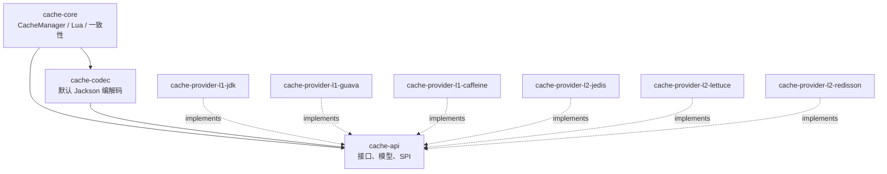
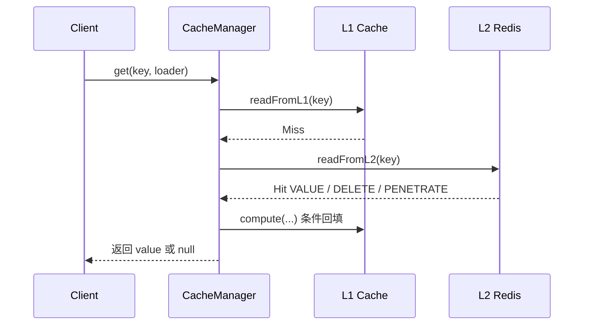
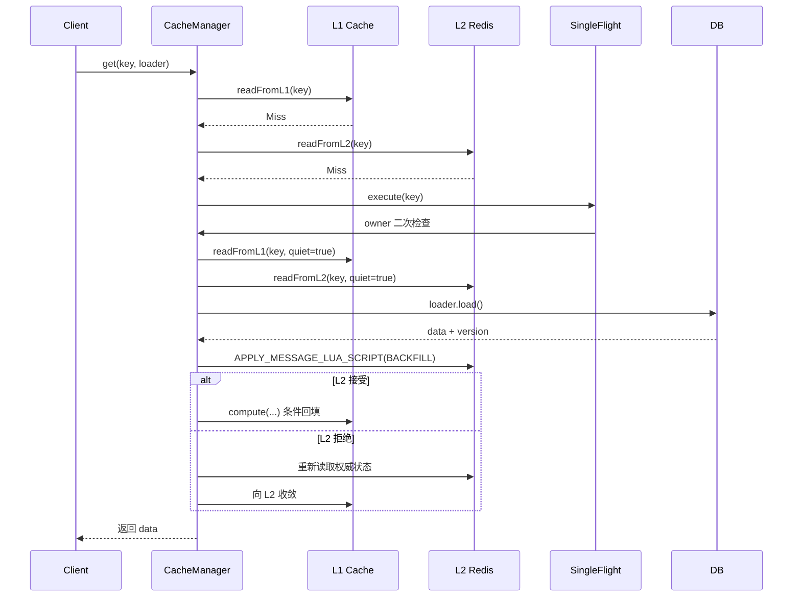
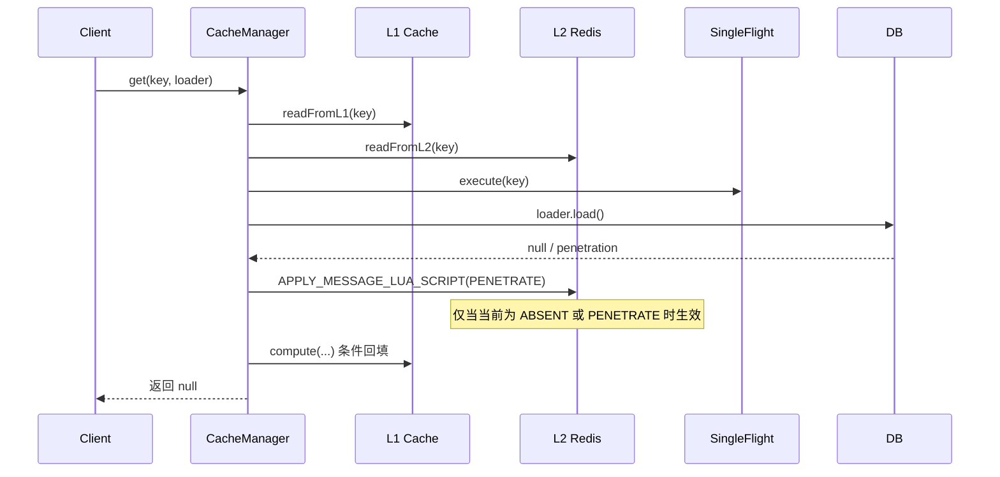
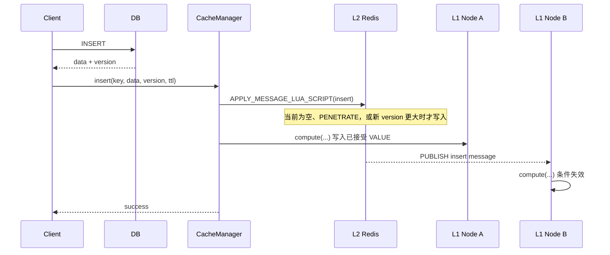
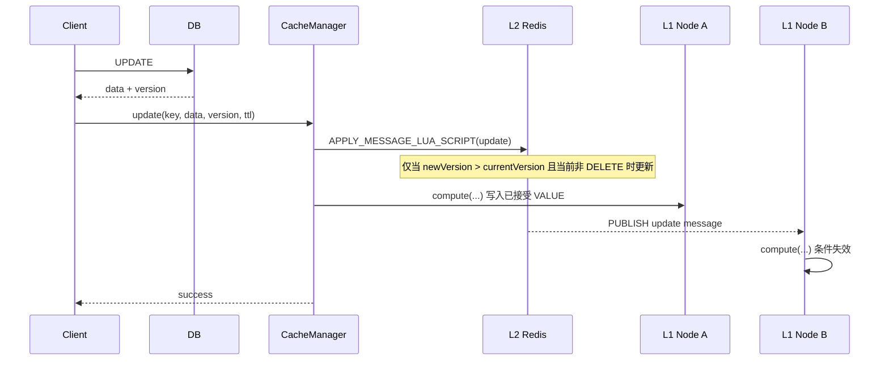
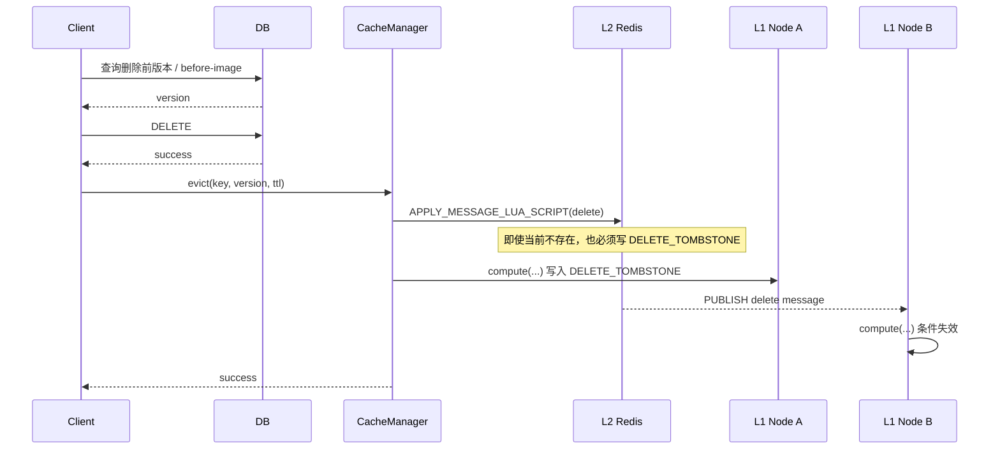

<div align="center">
  <h1>多级缓存框架 (Multi-Tier Cache Framework)</h1>


[](https://central.sonatype.com/search?q=io.github.dk900912)

  <p>一个面向 Java 应用的 L1 + L2 多级缓存框架，重点解决缓存击穿、缓存穿透、乱序消息、跨节点 L1 失效和最终一致性问题。</p>
</div>

## 1. 文档定位

这份 README 不是“快速上手小抄”，而是一份面向设计评审、接入评审和生产接入的技术说明书。它重点回答下面几类问题：

- 这个框架到底解决什么问题，不解决什么问题
- 读缓存与写缓存如何保证最终一致
- 业务 `version` 和删除墓碑如何阻止乱序覆盖与旧读回填
- `L1`、`L2`、Pub/Sub、补偿重放分别承担什么职责
- Redis keyspace、Lua 脚本、补偿边界、可观测性与生产限制分别是什么

## 2. 总览

### 2.1 核心能力

| 能力 | 当前状态 | 说明 |
| :---: | :---: | :---: |
| `L1 + L2` 多级缓存 | 支持 | `L1` 做本地热点加速，`L2` 做跨节点共享与裁决 |
| 缓存击穿保护 | 支持 | 内置 `SingleFlight`，同 key 并发 miss 只让一个线程回源 |
| 缓存穿透防护 | 支持 | `PENETRATE(version=-1)` 低优先级短 TTL 哨兵 |
| 最终一致性裁决 | 支持 | 基于业务 `version`，由 Redis Lua 脚本原子裁决 |
| 同 key 删后重建 | 不支持 | DB 删除后再次新增必须使用新主键，并形成新缓存 key |
| 乱序 / 重复消息抗性 | 支持 | `L2` 与 `L1` 共用同一套版本和状态比较规则 |
| 可观测性 | 支持 | 内置运行时指标快照 `CacheRuntimeStats` |
| Redis Cluster / ACL | 支持 | 已支持集群和 Redis 7 ACL |
| 可靠广播 | 不支持 | 当前基于 Redis Pub/Sub，不保证 peer 节点可靠收到 |
| 强一致读 | 不支持 | 当前语义是最终一致，不是线性一致或写后全局强一致 |

### 2.2 一句话理解

> `L2` 是权威裁决点，`L1` 是可丢弃副本，Pub/Sub 只是失效加速器，真正的一致性靠业务 `version + Lua CAS` 落地。

### 2.3 适用场景

- 业务允许跨节点存在极短暂陈旧窗口，但要求最终收敛
- 希望在 Java 应用内利用本地缓存显著提升热点命中率
- 需要解决并发回填、乱序消息、重复消息等缓存一致性问题
- 已接受 Redis 作为共享缓存与协调中心

### 2.4 非目标

- 不保证跨节点写后立刻可见
- 不保证同一 key 的全局有序消费
- 不保证 peer 节点对 Pub/Sub 消息的可靠接收
- 默认实现不提供真正持久化的补偿仓库
- 不支持同一个缓存 key 在 DB 删除后以重置或更低版本复活

## 3. 模块结构

### 3.1 多模块发布

当前版本：`1.0.0-M4`

| 模块 | 职责 | 说明 |
| :---: | :---: | :---: |
| `cache-api` | API / 模型 / SPI | 对外接口、配置模型、消息模型 |
| `cache-core` | 核心逻辑 | `CacheManager`、Lua 调度、读写路径、一致性逻辑 |
| `cache-codec` | 默认编解码 | `JacksonCacheCodec`，含反序列化白名单 |
| `cache-provider-l1-caffeine` | L1 Provider | 推荐生产优先选择 |
| `cache-provider-l1-guava` | L1 Provider | 可选 |
| `cache-provider-l1-jdk` | L1 Provider | 轻量但功能有限 |
| `cache-provider-l2-jedis` | L2 Provider | Redis/Jedis 实现 |
| `cache-provider-l2-lettuce` | L2 Provider | Redis/Lettuce 实现 |
| `cache-provider-l2-redisson` | L2 Provider | Redis/Redisson 实现 |

### 3.2 依赖拓扑



## 4. 快速接入

### 4.1 BOM 方式引入

```xml
<dependencyManagement>
  <dependencies>
    <dependency>
      <groupId>io.github.dk900912</groupId>
      <artifactId>multi-tier-cache-framework</artifactId>
      <version>1.0.0-M4</version>
      <type>pom</type>
      <scope>import</scope>
    </dependency>
  </dependencies>
</dependencyManagement>
```

### 4.2 常用模块组合

```xml
<dependencies>
  <dependency>
    <groupId>io.github.dk900912</groupId>
    <artifactId>cache-core</artifactId>
  </dependency>

  <dependency>
    <groupId>io.github.dk900912</groupId>
    <artifactId>cache-codec</artifactId>
  </dependency>

  <dependency>
    <groupId>io.github.dk900912</groupId>
    <artifactId>cache-provider-l1-caffeine</artifactId>
  </dependency>

  <dependency>
    <groupId>io.github.dk900912</groupId>
    <artifactId>cache-provider-l2-lettuce</artifactId>
  </dependency>
</dependencies>
```

### 4.3 极简示例

```java
import io.github.dk900912.multitiercache.api.CacheKey;
import io.github.dk900912.multitiercache.api.CacheLoader;
import io.github.dk900912.multitiercache.api.CacheManager;
import io.github.dk900912.multitiercache.api.model.CacheConfig;
import io.github.dk900912.multitiercache.api.model.CacheConfig.L1ProviderType;
import io.github.dk900912.multitiercache.api.model.CacheConfig.L2ProviderType;
import io.github.dk900912.multitiercache.api.model.CacheLoadResult;
import io.github.dk900912.multitiercache.core.CacheManagerFactory;

import java.time.Duration;
import java.util.List;

public class CacheExample {

    public static void main(String[] args) {
        CacheConfig config = new CacheConfig();

        config.getL1().setEnabled(true);
        config.getL1().setProvider(L1ProviderType.CAFFEINE);
        config.getL1().setRecordStats(true);
        config.getL1().setMaximumSize(10_000L);
        config.getL1().setExpireAfterWrite(Duration.ofSeconds(30));
        config.getL1().setExpireAfterAccess(Duration.ofSeconds(30));

        config.getL2().setEnabled(true);
        config.getL2().setProvider(L2ProviderType.LETTUCE);
        config.getL2().setHosts(List.of("127.0.0.1:7001", "127.0.0.1:7002", "127.0.0.1:7003"));
        config.getL2().setMutationChannelName("cache:mutation:user");
        config.getL2().setUsername("cache_user");
        config.getL2().setPassword("change-me");
        config.getL2().setConnectionTimeout(Duration.ofSeconds(2));
        config.getL2().setSocketTimeout(Duration.ofSeconds(2));
        config.getL2().setMaxRedirects(5);
        config.getL2().getSubscriber().setCorePoolSize(2);
        config.getL2().getSubscriber().setMaximumPoolSize(4);
        config.getL2().getSubscriber().setCapacity(1_000);

        // 生产环境必须显式配置业务包白名单。
        config.getCodec().setTrustedPackages(List.of("com.yourcompany.domain"));

        config.getSingleFlight().setAwaitTimeout(Duration.ofSeconds(3));

        config.getCacheMiss().setDefaultTtl(Duration.ofMinutes(10));
        config.getCacheMiss().setBackfillTtl(Duration.ofMinutes(10));
        config.getCacheMiss().setPenetrationTtl(Duration.ofSeconds(30));

        config.getCompensation().setEnabled(true);
        config.getCompensation().setInitialDelay(Duration.ofSeconds(10));
        config.getCompensation().setPeriod(Duration.ofSeconds(10));
        config.getCompensation().setBatchSize(100);

        CacheManager cacheManager = CacheManagerFactory.create(config);
        cacheManager.bootstrap();

        try {
            CacheKey key = CacheKey.simple("user:1001");

            User inserted = userRepository.insert(new User("Alice"));
            cacheManager.insert(key, inserted, inserted.getVersion(), Duration.ofMinutes(30));

            CacheLoader<User> loader = () -> {
                User dbUser = userRepository.findById(1001L);
                if (dbUser == null) {
                    return CacheLoadResult.penetration(Duration.ofSeconds(30));
                }
                return CacheLoadResult.of(dbUser, dbUser.getVersion(), Duration.ofMinutes(30));
            };
            User loaded = cacheManager.get(key, loader);

            User updated = userRepository.updateNameWithOptimisticLock(1001L, "Bob");
            if (updated != null) {
                cacheManager.update(key, updated, updated.getVersion(), Duration.ofMinutes(30));
            }

            User beforeDelete = userRepository.findById(1001L);
            if (beforeDelete != null) {
                userRepository.deleteById(1001L);
                cacheManager.evict(key, beforeDelete.getVersion(), Duration.ofMinutes(5));
            }
        } finally {
            cacheManager.shutdown();
        }
    }
}
```

补充：

- 如果只启用单机 `L1`，将 `config.getL2().setEnabled(false)`；如果只启用 `L2`，将 `config.getL1().setEnabled(false)`。
- `L2ProviderType.AUTO` 当前按 `LETTUCE -> REDISSON -> JEDIS` 选择；生产建议显式指定 provider。
- 使用 `JEDIS` 或 `REDISSON` 时，分别通过 `config.getL2().getJedis()` 或 `config.getL2().getRedisson()` 调整专属连接池参数。
- `CacheLoadResult` 允许 loader 显式返回 DB 版本与 TTL，是读回填最终一致性语义最清晰的接入方式。

### 4.4 业务接入约束

| 约束项 | 是否必须 | 说明 |
| :---: | :---: | :---: |
| 同生命周期内 `version` 单调递增 | 是 | 推荐由 DB 乐观锁或应用事务逻辑保证 |
| 删除前拿到删除前 `version` | 是 | 可来自 before-image、事务内查询、事件载荷 |
| 业务对象可被安全反序列化 | 是 | 需把包名加入 `trustedPackages` |
| 接受最终一致 | 是 | 当前不是强一致缓存 |
| 接受 Pub/Sub 非可靠投递 | 是 | 否则需升级到底层可靠消息模型 |

## 5. 核心模型

### 5.1 `CacheManager` 对外语义

| 方法 | 语义 | 说明 |
| :---: | :---: | :---: |
| `get(key, Supplier<T>)` | 读缓存 | `Supplier` 返回 `null` 会被视为穿透 |
| `get(key, Supplier<T>, ttl)` | 读缓存 | 为回源结果指定 TTL |
| `get(key, CacheLoader<T>)` | 读缓存 | 显式返回 `CacheLoadResult`，适合精确控制版本和 TTL |
| `insert(key, data, version, ttl)` | 写缓存 | 用于 DB 新增成功后的缓存写入 |
| `update(key, data, version, ttl)` | 写缓存 | 用于 DB 已有记录更新后的缓存写入 |
| `evict(key, version, ttl)` | 删除缓存 | 写删除墓碑，不是简单删除 key |
| `getMonitor()` | 获取监控 | 读取 `L1` 统计和框架运行指标 |

### 5.2 `CacheMessage`

`CacheMessage<T>` 是跨层、跨节点传播的一致性载体，关键字段如下：

| 字段 | 含义 | 来源 |
| :---: | :---: | :---: |
| `key` | 业务 key 字符串 | 业务方提供 |
| `data` | 真实数据载荷 | 真实值场景携带 |
| `version` | DB 数据版本 | 业务方提供，单条记录生命周期内严格单调递增 |
| `type` | 消息类型 | `INSERT` / `UPDATE` / `DELETE` / `BACKFILL` / `PENETRATE` |
| `ttlMillis` | TTL | 调用方或配置决定 |

### 5.3 状态模型

对单个 `key`，框架在逻辑上只承认三类状态：

| 状态 | 是否有数据 | 是否参与业务排序 | 语义 |
| :---: | :---: | :---: | :---: |
| `VALUE(version)` | 是 | 是 | 真实业务值 |
| `DELETE_TOMBSTONE(version)` | 否 | 是 | 业务删除态 |
| `PENETRATE(version=-1)` | 否 | 否 | 低优先级短 TTL 防穿透 hint |

### 5.4 DB 生命周期与 `version`

本框架严格依赖 DB 数据版本，不再维护框架侧生命周期代际。业务方必须保证：

- `insert`、`update`、`evict` 只能在 DB 对应插入、更新、删除成功后调用
- 同一条 DB 记录从插入到删除的完整生命周期内，`version` 严格单调递增
- 一条记录被 DB 删除后，如果未来重新新增语义上的同一对象，必须使用新的 DB 主键
- 缓存 key 必须包含或绑定该主键，因此“删除后复活”的记录必须形成新的缓存 key

同一个缓存 key 在删除墓碑 TTL 内不允许被非 DELETE 消息覆盖。框架将“同 key 删除后以重置版本复活”视为业务契约违规，不提供正确性保证。

## 6. 一致性设计总览

### 6.1 设计原则

- `L2` 是权威裁决点
- `L1` 是本地副本层
- 写路径先让 `L2` 成为权威，再把当前节点 `L1` 收敛到已接受状态
- 删除必须落墓碑，不能只广播不落 `L2`
- 读回填必须先过 `L2` 裁决，再决定是否写 `L1`
- `PENETRATE` 永远低于真实值和删除墓碑

### 6.2 排序规则

真正的比较键是：

```text
order = (type, version)
```

排序规则：

1. `PENETRATE` 固定最低优先级：
   - 只允许写入 `ABSENT`
   - 或刷新已有 `PENETRATE`
   - 永远不能覆盖真实值与删除墓碑
2. `DELETE` 是同 key 删除栅栏：
   - 覆盖真实值时使用 `incoming.version >= current.version`
   - 当前已是 `DELETE_TOMBSTONE` 时，只有版本不小于当前墓碑的 DELETE 能刷新墓碑
   - 当前是 `DELETE_TOMBSTONE` 时，拒绝任何 `INSERT / UPDATE / BACKFILL`
3. `INSERT / UPDATE / BACKFILL` 写真实值：
   - 覆盖真实值时必须满足 `incoming.version > current.version`
   - 可以覆盖 `PENETRATE`

### 6.3 L1 / L2 / Pub/Sub / 补偿的职责分工

| 组件 | 职责 | 关键约束 |
| :---: | :---: | :---: |
| `L1` | 本地热点缓存 | 只做条件回填、当前节点条件收敛和远端条件失效，不做跨节点真相源 |
| `L2` | 共享缓存 + 一致性裁决 | 通过 Lua 原子脚本决定最终胜者 |
| `Pub/Sub` | L1 失效加速器 | 不是可靠消息系统 |
| `CacheMessageRepository` | 当前节点写 L2 失败时的补偿落盘扩展点 | 不能补 peer 节点漏收 Pub/Sub |
| `CacheMessageReplayer` | 后台补偿重放 | 依赖真实持久化仓库才有生产价值 |

## 7. 读缓存与写缓存策略

### 7.1 写缓存总规则

| 操作 | 版本比较 | 是否 publish | 备注 |
| :---: | :---: | :---: | :---: |
| `INSERT` | `>` | 是 | DB 新增成功后的缓存写入，不用于同 key 复活 |
| `UPDATE` | `>` | 是 | DB 已有记录更新后的缓存写入 |
| `DELETE` | `>=` | 是 | 必须写墓碑 |
| `BACKFILL` | `>` | 否 | 读路径自愈，不是业务写事件 |
| `PENETRATE` | 不参与 | 否 | 只能写 `ABSENT` 或刷新自身 |

### 7.2 `insert`

#### 业务约束

- DB 插入成功后拿到最新实体和当前生命周期内 `version`
- `insert` 必须对应业务方新增一条 DB 记录
- 已删除记录如果重新新增，必须使用新的 DB 主键和新的缓存 key

#### L2 裁决表

| 当前状态 | 来新状态 | 条件 | 结果 |
| :---: | :---: | :---: | :---: |
| `ABSENT` | `VALUE(v)` | 总是 | 写入并 `publish` |
| `VALUE(oldV)` | `VALUE(newV)` | `newV > oldV` | 写入并 `publish` |
| `DELETE(oldV)` | `VALUE(newV)` | 总是拒绝 | `no-op` |
| `PENETRATE(-1)` | `VALUE(v)` | 总是 | 写入并 `publish` |
| 其他情况 | `VALUE(...)` | 不满足条件 | `no-op` |

#### L1 行为

- 当前节点：`L2` 接受成功后，将已接受的 `VALUE` 消息写入或刷新到本地 `L1`
- 其他节点：收到 `insert` 消息后，只对已存在且落后的本地条目做条件失效；本地原本为空时不预热

### 7.3 `update`

#### 业务约束

- DB 更新成功后，业务方提供最新实体和最新 `version`
- `update` 必须对应业务方更新一条 DB 已有记录

#### L2 裁决表

| 当前状态 | 来新状态 | 条件 | 结果 |
| :---: | :---: | :---: | :---: |
| `ABSENT` | `VALUE(v)` | 总是 | 写入并 `publish` |
| `VALUE(oldV)` | `VALUE(newV)` | `newV > oldV` | 写入并 `publish` |
| `DELETE(oldV)` | `VALUE(newV)` | 总是拒绝 | `no-op` |
| `PENETRATE(-1)` | `VALUE(v)` | 总是 | 写入并 `publish` |
| 其他情况 | `VALUE(...)` | 不满足条件 | `no-op` |

#### L1 行为

- 当前节点：`L2` 接受成功后，将已接受的 `VALUE` 消息写入或刷新到本地 `L1`
- 其他节点：收到 `update` 消息后，只对已存在且落后的本地条目做条件失效；本地原本为空时不预热

### 7.4 `delete / evict`

#### 业务约束

- 删除前必须拿到删除对应的 `version`
- 删除成功后调用 `evict` 写入删除墓碑
- 同一个缓存 key 在墓碑 TTL 内不允许被非 DELETE 状态覆盖

#### L2 裁决表

| 当前状态 | 来新状态 | 条件 | 结果 |
| :---: | :---: | :---: | :---: |
| `ABSENT` | `DELETE(v)` | 总是 | 写墓碑并 `publish` |
| `VALUE(oldV)` | `DELETE(newV)` | `newV >= oldV` | 写墓碑并 `publish` |
| `DELETE(oldV)` | `DELETE(newV)` | `newV >= oldV` | 刷新墓碑并 `publish` |
| `PENETRATE(-1)` | `DELETE(v)` | 总是 | 写墓碑并 `publish` |
| 其他情况 | `DELETE(...)` | 不满足条件 | `no-op` |

#### 删除特别注意

- 即使 `L2` 当前没有该 key，也必须写 `DELETE_TOMBSTONE`
- 删除墓碑 TTL 必须显著长于 `PENETRATE` TTL
- 删除墓碑的作用不是“缓存一个 null”，而是阻止删后旧读或延迟读把旧值重新灌回缓存

#### L1 行为

- 当前节点：`L2` 接受成功后，将 `DELETE_TOMBSTONE` 写入或刷新到本地 `L1`
- 其他节点：收到 `delete` 消息后，只对已存在且可被该墓碑覆盖的本地条目做条件失效；本地原本为空时不预热

### 7.5 读缓存：`L2 hit -> L1 backfill`

当 `L1 miss` 且 `L2 hit`：

- 命中 `VALUE(v)`：返回数据，并用 `L1.compute(...)` 条件回填
- 命中 `DELETE_TOMBSTONE(v)`：返回 `null`，并将 `L1` 向删除态收敛
- 命中 `PENETRATE(-1)`：返回 `null`，仅允许在 `L1` 不存在或也是 `PENETRATE` 时回填

#### L1 条件回填表

| 当前 L1 状态 | 来自 L2 的状态 | 条件 | 动作 |
| :---: | :---: | :---: | :---: |
| `ABSENT` | `VALUE / DELETE / PENETRATE` | 合法即写 | 回填 |
| `VALUE(v1)` | `VALUE(v2)` | `v2 > v1` | 回填 |
| `VALUE(v1)` | `DELETE(v2)` | `v2 >= v1` | 回填/删除 |
| `DELETE(v1)` | `VALUE(v2)` | 总是拒绝 | `no-op` |
| `VALUE / DELETE` | `PENETRATE(-1)` | 总是 | `no-op` |
| `PENETRATE(-1)` | `VALUE / DELETE` | 总是 | 回填 |

### 7.6 读缓存：`DB hit -> BACKFILL`

当 `L1 miss`、`L2 miss` 且 DB 回源命中：

1. 进入 `SingleFlight`
2. owner 再次检查 `L1` 和 `L2`
3. `loader` 返回真实值与真实 `version`
4. 先对 `L2` 执行 `BACKFILL` 原子裁决
5. 再决定是否回填 `L1`

#### 关键约束

- 如果 `L2` 已经拒绝这次回填，说明有更新状态已经赢了
- 当前节点不能再把旧数据直接写入 `L1`
- 正确做法是重新读取 `L2`，让本地向 `L2` 收敛

### 7.7 读缓存：`DB miss -> PENETRATE`

当 `L1 miss`、`L2 miss` 且 DB 也 miss：

- 框架写入 `PENETRATE(version=-1)`
- 它只表示“当前读路径确认未命中”，不是业务删除事件

#### `PENETRATE` 规则

| 当前状态 | 来新状态 | 条件 | 结果 |
| :---: | :---: | :---: | :---: |
| `ABSENT` | `PENETRATE(-1)` | 总是 | 写入 |
| `PENETRATE(-1)` | `PENETRATE(-1)` | 总是 | 刷新 TTL |
| `VALUE(...)` | `PENETRATE(-1)` | 总是 | `no-op` |
| `DELETE(...)` | `PENETRATE(-1)` | 总是 | `no-op` |

#### `PENETRATE` 不会做的事

- 不会发布 Pub/Sub 消息
- 不会覆盖真实值
- 不会覆盖删除墓碑
- 不参与业务生命周期排序

## 8. 时序图

> 下列时序图按操作拆分，不把 `insert`、`update`、`delete` 混在同一张图里。

### 8.1 读缓存：`L2 hit -> L1 backfill`



### 8.2 读缓存：`DB hit -> BACKFILL`



### 8.3 读缓存：`DB miss -> PENETRATE`



### 8.4 写缓存：`insert`



### 8.5 写缓存：`update`



### 8.6 写缓存：`delete / evict`



## 9. Redis Keyspace 设计

### 9.1 设计目标

当前 `CacheKeyspace` 的目标如下：

- 不把原始业务 key 直接暴露到 Redis key 名称中
- 保留完整 `SHA-256` 熵，避免截断哈希碰撞风险
- 使用 `Base64URL` 压缩标识长度，兼顾安全性与紧凑性

### 9.2 当前 keyspace 形式

| 键类型 | 格式 | 说明 |
| :---: | :---: | :---: |
| 数据键 | `mtc:data:{identifier}` | 存放 `CacheMessage` JSON |
| `identifier` | `SHA-256 + Base64URL(withoutPadding)` | 长度固定 43，字符安全 |

### 9.3 为什么要这样设计

| 问题 | 旧式设计的风险 | 当前设计的收益 |
| :---: | :---: | :---: |
| 业务 key 直接入 Redis | 泄漏 PII、特殊字符、超长 key | 改成 opaque key，不暴露原始业务 key |
| 截断 hash | 长期规模下碰撞风险更高 | 保留完整 `SHA-256` 熵 |
| Hex 编码 | 64 字符较长 | `Base64URL` 压缩到 43 字符 |
| Redis Cluster | 脚本不能跨 slot 操作多个 key | 当前脚本只访问单个 data key |

## 10. Lua 脚本职责

### 10.1 `APPLY_MESSAGE_LUA_SCRIPT`

用途：

- 读取当前 `CacheMessage`
- 原子比较 `type + version`
- 决定是否写入新状态
- 在 mutation 路径中原子执行 `SET + PUBLISH`

### 10.2 为什么必须用 Lua

| 如果不用 Lua | 风险 |
| :---: | :---: |
| Java 侧先 `GET` 再 `SET` | 读写窗口会被并发穿透，产生 TOCTOU 问题 |
| `SET` 与 `PUBLISH` 分离 | 无法保证同一 winner 的落库与广播语义一致 |
| 非原子版本比较 | 旧版本或重复消息可能覆盖新状态 |

## 11. 配置参考

### 11.1 `L1Config`

| 字段 | 类型 | 含义 | 默认值 |
| :---: | :---: | :---: | :---: |
| `enabled` | `boolean` | 是否启用 `L1` | `true` |
| `provider` | `L1ProviderType` | `L1` Provider 选择，`AUTO` 按内置优先级选择 | `AUTO` |
| `recordStats` | `boolean` | 是否记录 `L1` 原生统计 | `false` |
| `maximumSize` | `Long` | `L1` 最大条目数 | `1000` |
| `expireAfterWrite` | `Duration` | 写后全局过期时间 | `15s` |
| `expireAfterAccess` | `Duration` | 访问后全局过期时间 | `15s` |
| `fineGrainedExpiry` | `FineGrainedExpiry` | 细粒度过期策略 | `null` |

补充：

- `AUTO` 下当前内置优先级为 `CAFFEINE -> GUAVA -> JDK`
- `fineGrainedExpiry` 仅在 `CaffeineL1Provider` 下生效
- `JdkL1Provider` 不支持 `recordStats=true`
- `L1` TTL 是最后一道陈旧数据兜底，不应配置得过长
- 当前 `L1` 原生过期由 `expireAfterWrite / expireAfterAccess` 或 Caffeine 细粒度策略决定，不内置按 `CacheMessage.ttlMillis` 自动逐条过期

### 11.2 `L2Config`

| 字段 | 类型 | 含义 | 默认值 |
| :---: | :---: | :---: | :---: |
| `enabled` | `boolean` | 是否启用 `L2` | `true` |
| `provider` | `L2ProviderType` | `L2` Provider 选择，`AUTO` 按内置优先级选择 | `AUTO` |
| `mutationChannelName` | `String` | Pub/Sub 变更频道 | `multi-tier-cache-mutation` |
| `hosts` | `List<String>` | Redis 节点列表 | 必填 |
| `connectionTimeout` | `Duration` | 连接超时 | `6s` |
| `socketTimeout` | `Duration` | 读写超时 | `6s` |
| `maxRedirects` | `Integer` | 集群最大重定向次数 | `5` |
| `username` | `String` | Redis ACL 用户名 | `null` |
| `password` | `String` | Redis 密码 | `null` |
| `jedis` | `Jedis` | Jedis 专属连接池配置 | 见下表 |
| `redisson` | `Redisson` | Redisson 专属连接池配置 | 见下表 |

补充：

- `AUTO` 下当前内置优先级为 `LETTUCE -> REDISSON -> JEDIS`
- 启用 `L2` 时，`hosts` 与 `mutationChannelName` 必填
- ACL 模式下建议显式配置 `username + password`
- Redis 7 中 key 权限与 channel 权限分离，生产授权时需要同时放行
- 历史版本的 `maxTotal/maxIdle/minIdle/maxWait` 通用池化字段已改为 legacy，仅 Jedis 继续兼容；Lettuce/Redisson 使用这些字段会在 provider 校验阶段失败

### 11.3 `L2Config.Jedis`

| 字段 | 类型 | 含义 | 默认值 |
| :---: | :---: | :---: | :---: |
| `maxTotal` | `Integer` | Jedis 连接池最大活跃数 | `10` |
| `maxIdle` | `Integer` | Jedis 连接池最大空闲数 | `1` |
| `minIdle` | `Integer` | Jedis 连接池最小空闲数 | `1` |
| `maxWait` | `Duration` | Jedis 取连接最大等待时间 | `6s` |

### 11.4 `L2Config.Redisson`

| 字段 | 类型 | 含义 | 默认值 |
| :---: | :---: | :---: | :---: |
| `masterConnectionPoolSize` | `Integer` | master 连接池大小 | `10` |
| `slaveConnectionPoolSize` | `Integer` | slave 连接池大小 | `10` |
| `masterConnectionMinimumIdleSize` | `Integer` | master 最小空闲连接数 | `1` |
| `slaveConnectionMinimumIdleSize` | `Integer` | slave 最小空闲连接数 | `1` |

### 11.5 `L2Config.Subscriber`

| 字段 | 类型 | 含义 | 默认值 |
| :---: | :---: | :---: | :---: |
| `corePoolSize` | `int` | 核心线程数 | `4` |
| `maximumPoolSize` | `int` | 最大线程数 | `8` |
| `keepAliveTime` | `Duration` | 非核心线程空闲时间 | `0` |
| `capacity` | `int` | 队列容量 | `100` |

### 11.6 `CodecConfig`

| 字段 | 类型 | 含义 | 默认值 |
| :---: | :---: | :---: | :---: |
| `trustedPackages` | `List<String>` | 允许反序列化的业务类包前缀 | `[]` |

补充：

- 默认只允许框架内置和基础 JDK 类型
- 业务对象所在包必须加入白名单
- 这是防止 Jackson 多态反序列化 RCE 风险的关键防线

### 11.7 `SingleFlight`

| 字段 | 类型 | 含义 | 默认值 |
| :---: | :---: | :---: | :---: |
| `awaitTimeout` | `Duration` | 并发 miss 等待 owner 结果的超时时间 | `10s` |

### 11.8 `Compensation`

| 字段 | 类型 | 含义 | 默认值 |
| :---: | :---: | :---: | :---: |
| `enabled` | `boolean` | 是否启动本地补偿重放任务 | `true` |
| `initialDelay` | `Duration` | 首次补偿重放延迟 | `10s` |
| `period` | `Duration` | 补偿重放周期 | `10s` |
| `batchSize` | `int` | 每批处理消息数量 | `100` |

补充：

- 当 `L2` 关闭或没有自定义持久化 `CacheMessageRepository` 时，框架不会启动无意义的补偿重放线程

### 11.9 `CacheMiss`

| 字段 | 类型 | 含义 | 默认值 |
| :---: | :---: | :---: | :---: |
| `penetrationTtl` | `Duration` | `PENETRATE` TTL | `30s` |
| `backfillTtl` | `Duration` | 读回填 TTL | `15s` |
| `defaultTtl` | `Duration` | `Supplier` 便捷重载默认 TTL | `15s` |

## 12. 扩展点

### 12.1 SPI 一览

| 扩展点 | 接口 | 默认实现 | 用途 |
| :---: | :---: | :---: | :---: |
| 编解码 | `CacheCodec` | `JacksonCacheCodec` | 替换序列化方案 |
| 本地缓存 | `L1Provider` | `Caffeine` / `Guava` / `JDK` | 替换本地缓存实现 |
| 分布式缓存 | `L2Provider` | `Lettuce` / `Redisson` / `Jedis` | 替换 Redis 客户端或接入其他 KV |
| 补偿仓库 | `CacheMessageRepository` | `DefaultCacheMessageRepository` | 接入 DB / MQ 做真实持久化补偿 |

### 12.2 `CacheMessageRepository` 的真实职责边界

| 问题 | 当前是否能解决 | 说明 |
| :---: | :---: | :---: |
| 当前节点写 `L2` 失败 | 能 | 可落补偿仓库并由 `CacheMessageReplayer` 重放 |
| 基于 Pub/Sub 的通知模型边界 | 不能 | 这是底层通知模型的能力边界，不属于补偿仓库职责 |

补充说明：

- `CacheMessageRepository` 的定位是**当前节点 mutation 出站失败时的补偿扩展点**
- 它不负责把 `Redis Pub/Sub` 变成可靠消息系统
- 如果业务要求可靠通知或逐节点可追赶的变更流，需要升级为带确认与重投语义的模型，例如 `Redis Stream`、`RocketMQ`、`Kafka`

## 13. 可观测性

### 13.1 监控入口

```java
CacheMonitor monitor = cacheManager.getMonitor();

L1CacheStats l1Stats = monitor.getL1CacheStats();
CacheRuntimeStats runtimeStats = monitor.getRuntimeStats();

System.out.println(runtimeStats.getL1Hits());
System.out.println(runtimeStats.getL2Misses());
System.out.println(runtimeStats.getL2MutationApplyAccepted());
System.out.println(runtimeStats.getReplayMessagesApplied());
```

### 13.2 `CacheRuntimeStats` 指标分类

#### 读路径指标

| 字段 | 含义 | 常见用途 |
| :---: | :---: | :---: |
| `l1Hits` | `L1` 命中次数 | 观察本地热点吸收能力 |
| `l1Misses` | `L1` miss 次数 | 判断本地缓存缺口 |
| `l2Hits` | `L2` 命中次数 | 观察共享缓存兜底效果 |
| `l2Misses` | `L2` miss 次数 | 判断回源频率 |
| `l2ReadFailures` | `L2` 读取、解码或校验失败次数 | 观察 Redis 读降级是否发生 |
| `loaderCalls` | 实际执行 loader 次数 | 判断真实回源压力 |
| `loaderValueCalls` | loader 返回真实值次数 | 观察正常回填量 |
| `loaderPenetrationCalls` | loader 进入穿透次数 | 观察穿透压力 |

#### L1 更新指标

| 字段 | 含义 | 常见用途 |
| :---: | :---: | :---: |
| `l1BackfillApplied` | `L1` 条件回填成功次数 | 观察 `L1` 向 `L2` 收敛频率 |
| `l1BackfillSkipped` | `L1` 条件回填被拒绝次数 | 识别旧回填竞争 |
| `l1InvalidationsApplied` | `L1` 条件收敛或条件失效成功次数 | 判断本地写收敛和广播失效是否生效 |
| `l1InvalidationsSkipped` | `L1` 条件收敛或条件失效被跳过次数 | 判断消息到达时本地已更新或已空 |

#### L2 裁决指标

| 字段 | 含义 | 常见用途 |
| :---: | :---: | :---: |
| `l2ReadApplyAccepted` | `BACKFILL/PENETRATE` 被接受次数 | 观察读路径自愈写入量 |
| `l2ReadApplyRejected` | 读路径写入被拒绝次数 | 判断旧读回填竞争 |
| `l2ReadApplyFailures` | 读路径写入 `L2` 异常次数 | Redis / Lua 故障告警 |
| `l2MutationApplyAccepted` | 写路径被接受次数 | 判断有效 mutation 量 |
| `l2MutationApplyRejected` | 写路径被拒绝次数 | 识别乱序、重复、旧写入 |
| `l2MutationApplyFailures` | 写路径写 `L2` 异常次数 | 高优先级故障指标 |

#### 补偿与广播指标

| 字段 | 含义 | 常见用途 |
| :---: | :---: | :---: |
| `compensationSaveSuccesses` | 落补偿仓库成功次数 | 判断补偿兜底是否发挥作用 |
| `compensationSaveFailures` | 落补偿仓库失败次数 | 严重告警 |
| `pubSubMessagesReceived` | 收到广播次数 | 观察失效传播活跃度 |
| `replayRuns` | 重放任务执行次数 | 判断补偿任务是否正常运行 |
| `replayMessagesFetched` | 拉取到的补偿消息数 | 观察积压规模 |
| `replayMessagesSkipped` | 跳过消息数 | 观察无效或已过时消息 |
| `replayMessagesApplied` | 成功重放次数 | 判断补偿效果 |
| `replayMessagesFailed` | 重放失败次数 | 观察补偿风险 |

### 13.3 生产环境重点关注

| 指标组 | 重点字段 | 用途 |
| :---: | :---: | :---: |
| 命中率 | `l1Hits / l1Misses / l2Hits / l2Misses` | 判断热点沉淀是否健康 |
| 一致性裁决 | `l2ReadApplyRejected / l2MutationApplyRejected` | 判断旧回填、乱序、重复消息比例 |
| 补偿安全 | `compensationSaveFailures / replayMessagesFailed` | 最终一致性兜底告警 |
| 穿透压力 | `loaderPenetrationCalls` | 判断空查与冷 key 扫描 |
| 读降级 | `l2ReadFailures / loaderCalls` | 判断 Redis 读故障是否正在把压力导向 DB |
| 收敛传播 | `pubSubMessagesReceived / l1InvalidationsApplied` | 观察跨节点 L1 收敛与失效活跃度 |

### 13.4 指标解读注意事项

- `l2MutationApplyRejected` 上升不一定是坏事，通常说明框架正在成功拒绝旧版本或重复消息
- `l2ReadApplyRejected` 上升通常意味着并发读写竞争增多
- `pubSubMessagesReceived = 0` 不能证明“系统没有丢消息”，它只表示当前节点没收到广播
- 当前监控是框架级计数，不是完整的 Prometheus / Grafana 生产方案

## 14. 生产边界与上线建议

### 14.1 当前版本能做到什么

| 能力边界 | 结论 |
| :---: | :---: |
| 最终一致 | 能 |
| 跨节点强一致 | 不能 |
| 本地热点加速 | 能 |
| 乱序 / 重复消息抗性 | 能 |
| 删除与并发读竞争防护 | 能 |
| 同 key 删后重建 | 不能 |
| 删除后用新 key 新增 | 能 |
| peer 节点可靠收消息 | 不能 |
| 默认补偿持久化 | 不能 |

### 14.2 正式生产前必须补齐的项

| 项目 | 当前状态 | 建议 |
| :---: | :---: | :---: |
| 真实持久化补偿仓库 | 缺失 | 自定义 `CacheMessageRepository` 接 DB / MQ |
| 指标平台接入 | 缺失 | 接 Micrometer / Prometheus / Grafana |
| 可靠消息链路 | 缺失 | 若业务要求可靠传播，改用 `Redis Stream` 或 MQ |
| 故障演练 | 需业务侧执行 | 覆盖 Redis 主从切换、网络闪断、STW、补偿积压 |
| 参数定标 | 需业务侧执行 | `L1 TTL`、`penetrationTtl`、`delete tombstone TTL`、线程池、连接池 |

### 14.3 适合怎样的上线策略

- 先在预发、灰度、小流量链路试运行
- 核心链路上线前先落真实补偿仓库
- 需要可靠广播的业务不要直接依赖 Redis Pub/Sub 默认模型

## 15. FAQ

### 15.1 这个框架是否依赖“同一 key 的全局有序消费”？

**不依赖。**

它依赖的是业务 `version` 与消息状态的乐观裁决，而不是同一 key 的全局顺序消费。即使消息乱序到达，只要旧消息版本更小或不满足状态规则，就会被 `L2` 与 `L1` 裁决拒绝。

### 15.2 为什么 `delete` 用 `>=`，而 `insert/update/backfill` 用 `>`？

因为删除需要允许“同版本 tombstone 覆盖 live value”，这样才能在业务删除成功后稳定落删除态，避免 live value 在边界条件下残留。

### 15.3 为什么 `PENETRATE` 固定为 `version=-1`？

因为它不是业务状态，只是低优先级短 TTL 空值 hint。它的职责是防穿透，不是参与业务生命周期排序。

### 15.4 为什么写路径要“先写 L2，再收敛当前节点 L1”？

如果先改或删本地 `L1`，并发读线程可能 miss 到旧 `L2`，然后把旧值重新灌回当前节点 `L1`。先让 `L2` 成为权威后，当前节点只保存已经被 `L2` 接受的 winner 或删除墓碑；远端节点收到 Pub/Sub 后只条件失效已有旧副本，不预热空 `L1`。

### 15.5 `CacheMessageRepository` 能修复 Pub/Sub 丢消息吗？

**不能。**

它能补的是：**当前写节点自己还没成功把 mutation 同步到 `L2`**。  
它不能解决的是：**`Redis Pub/Sub` 作为通知模型本身不提供可靠投递**。如果业务需要可靠通知，应升级底层消息模型，而不是让 `CacheMessageRepository` 承担这个职责。

- 对 `Node A` 来说，这次 mutation 是成功的，不会触发补偿保存
- 对 Redis Pub/Sub 来说，这条消息已经发完，不会为离线消费者保留
- 对 `Node B` 来说，它只是不知道自己错过了消息

所以 `CacheMessageRepository` 不是“对所有节点可靠补发广播”的机制，它只是“当前节点出站 mutation 失败时的补偿扩展点”。

### 15.6 这个框架是否已经 production-ready？

更准确的说法是：**已经具备生产候选能力，但不是开箱即生产。**

想达到更稳妥的正式生产标准，至少需要补齐：

- 真实持久化补偿仓库
- 监控平台接入
- 生产级故障演练
- 如果业务要求可靠广播，则升级底层消息模型

### 15.7 这个框架是否支持主动刷新（Refresh-Ahead）？

**当前不支持。**

当前实现是标准的被动加载型 `Cache-Aside`：只有在真实读流量发生 miss 时才会触发回源和回填。

### 15.8 这个框架如何防缓存击穿？

通过 JVM 内的 `SingleFlight`。

同一个节点内、同一个 `key` 的并发 miss，只会放行一个 owner 线程执行 `loader`，其他线程等待 owner 的结果。框架还会在 owner 真正执行 `loader` 前再次检查 `L1` 和 `L2`，尽量减少重复回源。

#### 扩展建议：如何实现“全局唯一回源”？

框架出于轻量化考量未内置分布式锁，但 `CacheLoader` 接口可以承载业务侧的分布式锁逻辑。

如果业务确实有极高一致性要求或 DB 极为脆弱，可以在 `CacheLoader.load()` 内自行包裹分布式锁，例如 Redisson Lock。框架层已有单机 `SingleFlight`，所以分布式锁只会面对每个节点内被合并后的 miss 请求。

> **代码证据：在 `DefaultCacheManager.get` 里，顺序是：**
>
> 1. 先 readFromL1(key)
> 2. 再 readFromL2(key)
> 3. 都 miss 才进入 loadWithSingleFlight(...)，然后在 loadAsSingleFlightOwner 里，作为 singleflight owner，又会再做一轮 quiet 重试：
>    - readFromL1(key, true)
>    - readFromL2(key, true)
> 4. 最后才执行 loader.load()
>
> 所以业务自定义 `CacheLoader` 不需要再做框架层面的 double check，只需要聚焦真实回源或分布式锁逻辑。

### 15.9 为什么仍然建议显式调用 `cacheManager.shutdown()`？

即便某些场景下 JVM 只剩 daemon 线程仍可自动退出，也不应该把这种行为当成资源管理契约。显式调用 `shutdown()` 才是正确的使用方式，可以确保订阅连接、连接池与后台任务按预期关闭。

### 15.10 为什么需要多级缓存，而不是只用 L1 或只用 L2？

因为它们解决的是不同问题：

- 只有 `L1`：热点快，但多节点不一致
- 只有 `L2`：一致性更容易收敛，但所有读都要走网络
- `L1 + L2`：`L1` 吸收热点，`L2` 负责共享兜底与最终一致裁决
